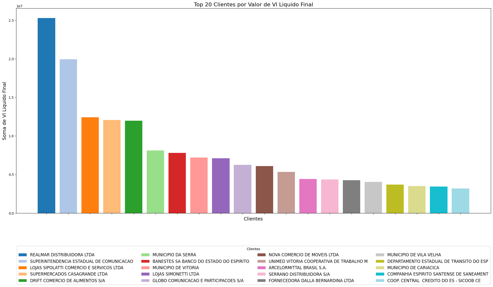

# Documentação Modelo Preditivo - Inteli

## Atena
### Data 027
#### Andre Dleizer Cintra do Prado, Eduardo Farias Rizk, Leonardo Souza Martins, Marlos do Carmo Guedes, Pedro El Haouli Faria, Thiago Martins Volcati de Almeida, Raul Rezende Szpak

## Sumário
[1. Introdução](#c1)

[2. Objetivos e Justificativa](#c2)

[3. Metodologia](#c3)

[4. Desenvolvimento e Resultados](#c4)

[5. Conclusões e Recomendações](#c5)

[6. Referências](#c6)

[Anexos](#attachments)

## 1. Introdução

&nbsp;&nbsp;&nbsp;&nbsp;A Rede Gazeta do Espírito Santo é o maior grupo de comunicação do estado, com mais de 500 funcionários. Localizada em Vitória, atua nos segmentos de jornalismo, rádio, TV e portais de notícias. Fundada em 1928, é reconhecida pela credibilidade, ética e modernidade, sendo líder no mercado de comunicação capixaba.

&nbsp;&nbsp;&nbsp;&nbsp;O problema a ser resolvido para a Rede Gazeta é que as metas de venda de publicidade são baseadas apenas no desempenho do ano anterior, sem considerar fatores críticos como sazonalidade, desempenho dos setores dos clientes e eventos extraordinários. Ajustes são feitos com base no bom senso dos gestores, sem análise técnica ou quantitativa. Além disso, taxas de ocupação de inventário e descontos aplicados não são levados em conta, afetando a precisão das metas e a rentabilidade do negócio.

&nbsp;&nbsp;&nbsp;&nbsp;Para atender essa demanda, o grupo "Data 027" desenvolveu a "Atena" um modelo preditivo por regressão que tem como objetivo prever receitas futuras e auxiliar na métrica de metas e objetivos da empresa a partir dos dados que afetam seu rendimento.

## 2. Objetivos e Justificativa
Para definir um escopo e iniciar o projeto, é necessário criar objetivos claros e sólidos, que façam sentido para o contexto apresentado. Nessa perspectiva, é possível elaborar uma proposta de solução viável acompanhada de uma justificativa coerente para tomada de decisão.

### 2.1 Objetivos

#### Objetivo Geral:
&nbsp;&nbsp;&nbsp;&nbsp;Desenvolver um modelo preditivo de receitas publicitárias por veículo para a Rede Gazeta. Este modelo permitirá prever com maior precisão o potencial de receita futura, maximizando os resultados financeiros da empresa ao considerar variáveis críticas e dados históricos, além de aprimorar a definição e o alcance das metas de vendas.
#### Objetivos Específicos:
1. **Definir Metas de Receita com Maior Precisão:** Estabelecer metas de receita mais assertivas para diversos segmentos de atuação, utilizando uma abordagem baseada em dados.

2. **Tomada de Decisões Baseada em Inteligência de Dados:** Utilizar o modelo preditivo para fundamentar decisões estratégicas na alocação de metas e na distribuição de receitas, otimizando os recursos disponíveis.

3. **Incorporar Sazonalidades e Tendências Econômicas:** Analisar e integrar informações detalhadas sobre o desempenho histórico, sazonalidades e tendências econômicas para refinar as previsões de receita.

### 2.2 Proposta de solução
&nbsp;&nbsp;&nbsp;&nbsp;A fim de aprimorar a tomada de decisão baseada em dados estatísticos, propõe-se um modelo de predição de dados. O modelo deve ser capaz de analisar dados internos da Rede Gazeta juntamente com dados econômicos externos do Espírito Santo e do Brasil, fornecidos pelo Instituto Jones dos Santos Neves (IJSN). A solução visa gerar metas realistas, prever receitas futuras e discernir esses resultados por segmento de atuação da Rede Gazeta (TV, rádio, digital) e por região (Grande Vitória, Sul, Norte, Noroeste).
Ao incorporar fatores críticos que atualmente não são considerados, como evolução de desempenho dos principais setores dos clientes, assim o modelo proporcionará previsões mais assertivas. Além disso, levará em conta as taxas de ocupação do inventário e as taxas de desconto aplicadas, que impactam diretamente na receita total e na rentabilidade do negócio.

### 2.3 Justificativa

&nbsp;&nbsp;&nbsp;&nbsp;Com a implementação de um modelo preditivo, a Gazeta TV pode alcançar uma previsão de crescimento de receita e definição de metas muito mais precisas. Isso contribuirá significativamente para o planejamento financeiro da empresa, auxiliando na necessidade de redução de custos e melhor gestão de recursos. Adicionalmente, o modelo preditivo pode ajudar na organização de parcerias futuras, identificando como elas podem impactar a receita da empresa. Isso permitirá tomar decisões mais inteligentes baseadas em dados reais, otimizando as decisões econômicas.
Outros benefícios incluem a melhoria na eficiência operacional, pois ao prever demandas e tendências, a Gazeta TV pode ajustar suas operações para melhorar a eficiência e reduzir desperdícios. 

## 3. Metodologia

&nbsp;&nbsp;&nbsp;&nbsp;Para o desenvolvimento do modelo preditivo, será utilizada a metodologia CRISP-DM, que organiza o processo em seis etapas principais:

1. **Entendimento do Negócio**: O primeiro passo é entender claramente o que o negócio precisa e quais são os objetivos. É essencial identificar qual problema deve ser resolvido e o que o modelo preditivo precisa alcançar.

2. **Entendimento dos Dados**: Após entender as necessidades do negócio, deve-se analisar os dados disponíveis. Nessa etapa, serão examinados os dados para identificar padrões ou informações relevantes e verificar se são adequados para resolver o problema.

3. **Preparação dos Dados**: Com os dados em mãos, será necessário prepará-los para o uso no modelo. Isso inclui limpar os dados, corrigir erros, transformar informações e selecionar os dados mais úteis. O objetivo é deixar os dados prontos e organizados para a próxima etapa.

4. **Modelagem**: Nesta fase, será aplicado o aprendizado de máquina para criar o modelo preditivo. Serão testados diferentes métodos para identificar qual funciona melhor com os dados preparados.

5. **Avaliação**: Após a criação do modelo, será verificado se ele realmente atende aos objetivos. Isso envolve testar o modelo e avaliar se os resultados são adequados e úteis para o negócio.

6. **Implantação**: A última etapa é colocar o modelo em funcionamento na prática. Isso significa integrá-lo aos sistemas da empresa ou criar relatórios que possam ser usados para tomar decisões baseadas nas previsões do modelo.

&nbsp;&nbsp;&nbsp;&nbsp;A escolha da metodologia CRISP-DM para desenvolver o modelo preditivo é estratégica, pois oferece uma abordagem organizada e prática para lidar com projetos de análise de dados. Usar esse método ajuda a garantir que todas as etapas essenciais sejam realizadas de forma estruturada, desde o entendimento inicial do problema até a implementação final do modelo. Isso é crucial para evitar erros, garantir que o modelo esteja alinhado com as necessidades do negócio e aumentar as chances de sucesso do projeto.

&nbsp;&nbsp;&nbsp;&nbsp;No decorrer do trabalho, o CRISP-DM serve como um guia. Primeiro, auxilia no entendimento claro do problema do negócio, definindo exatamente o que será resolvido. Em seguida, orienta a exploração e preparação dos dados, garantindo que se trabalhe com informações confiáveis e relevantes. Na fase de modelagem, o CRISP-DM oferece a segurança de que estão sendo escolhidos os métodos corretos para a criação do modelo preditivo. Posteriormente, na fase de avaliação, o método permite testar e validar o modelo, assegurando que ele funcione adequadamente antes de ser implementado.

&nbsp;&nbsp;&nbsp;&nbsp;Finalmente, na etapa de implantação, o CRISP-DM auxilia na integração dos resultados ao dia a dia da empresa, seja por meio de relatórios ou pela automação de decisões baseadas nas previsões do modelo. Essa estrutura clara e iterativa facilita o trabalho, tornando cada etapa mais eficiente e alinhada com os objetivos do negócio. Por isso, o CRISP-DM é uma escolha tão popular e eficaz para projetos de análise preditiva.

## 4. Desenvolvimento e Resultados
&nbsp;&nbsp;&nbsp;&nbsp;Nesta seção, detalharemos o desenvolvimento da Atena, abrangendo desde a compreensão do problema até a avaliação dos resultados obtidos. Começaremos com a análise do contexto da indústria e da empresa, seguida por um planejamento detalhado da solução, exploração e preparação dos dados, modelagem e comparação de diferentes abordagens. Por fim, discutiremos a avaliação do modelo final, sua aplicabilidade ao negócio, e as métricas utilizadas para garantir a precisão das previsões.
### 4.1. Compreensão do Problema
&nbsp;&nbsp;&nbsp;&nbsp;Neste tópico, realizaremos pesquisas e estudos para entender melhor o problema apresentado, além de conhecer mais detalhadamente nosso parceiro e seu posicionamento no mercado atual. Isso aumentará nossa compreensão sobre o projeto que desenvolveremos, proporcionando uma base sólida para atender às expectativas e necessidades da Rede Gazeta.

#### 4.1.1. Contexto da indústria 

&nbsp;&nbsp;&nbsp;&nbsp;A indústria de mídia no Brasil é dominada por grandes conglomerados como Globo, Record e SBT, que combinam receitas de assinaturas, publicidade e parcerias estratégicas. A digitalização e a união de diferentes mídias são tendências importantes, impulsionando a inovação no setor, com foco na integração de múltiplas plataformas para aumentar o alcance e a eficácia das campanhas publicitárias.

&nbsp;&nbsp;&nbsp;&nbsp;A Gazeta, parte da Rede Gazeta, é um importante veículo de comunicação no Espírito Santo, fundado em 1928. Afiliada à Rede Globo desde 1976, expandiu-se para TV, rádio e digital. Atualmente, a empresa foca na digitalização e personalização de conteúdos, utilizando modelos preditivos para atender às demandas do público e melhorar estratégias publicitárias

&nbsp;&nbsp;&nbsp;&nbsp; A análise das 5 forças de Porter é uma ferramenta que ajuda a entender a competitividade de um mercado. Ela avalia cinco aspectos principais: a ameaça de novos entrantes, o poder de barganha dos fornecedores, o poder de barganha dos clientes, a ameaça de produtos substitutos e a rivalidade entre concorrentes. Utilizando essa análise, podemos identificar as forças que influenciam a capacidade da Rede Gazeta de competir e prosperar no mercado de mídia do Espírito Santo. A seguir, apresentamos essa análise aplicada à Rede Gazeta, destacando como cada força impacta sua posição competitiva.

##### Ameaça de Novos Entrantes

&nbsp;&nbsp;&nbsp;&nbsp;A Rede Gazeta enfrenta diversas forças competitivas no mercado de mídia do Espírito Santo. As barreiras de entrada, como o alto investimento inicial, regulamentações rigorosas e a forte reputação da marca, dificultam a entrada de novos concorrentes.

**Alto investimento inicial**

O estabelecimento de uma emissora de televisão requer um investimento alto em equipamentos técnicos, estúdios, torres de transmissão e tecnologia de ponta. Após garantir a infraestrutura, produzir conteúdo de qualidade que atraia uma audiência significativa também demanda recursos elevados. Isso inclui a contratação de talentos, direitos autorais de programas, produção de novelas, jornalismo de qualidade, e a criação de programas originais.

**Regulamentação Rigorosa**

Além dos requisitos internos do novo entrante, o mercado de televisão é fortemente regulado pelo governo. Novos entrantes precisam obter concessões de transmissão, que são limitadas e exigem um rigoroso cumprimento das normas legais e técnicas. Depois disso, as emissoras devem seguir uma série de regulamentos em relação ao conteúdo, publicidade e horários de exibição, o que pode ser desafiador para uma nova empresa que ainda não possui experiência no setor.

**Reputação das Marcas Estabelecidas**

Por fim, se o novo concorrente conseguir superar as dificuldades anteriores, a concorrência com emissoras como Globo, Record, SBT, e Rede Gazeta já têm uma base de audiência consolidada e leal, construída ao longo de décadas, será intensa. A confiança e o reconhecimento da marca tornam difícil para novos entrantes capturarem uma parcela significativa dessa audiência. Isso também é considerado sobre a relação da nova empresa com os anunciantes, grandes emissoras têm relacionamentos duradouros com seus clientes, que são muitas vezes baseados em resultados comprovados e históricos de sucesso em campanhas publicitárias. Novos entrantes precisam demonstrar seu valor, o que pode levar tempo e requer investimentos em provas de conceito.

**Conclusão**

Essas barreiras criam um ambiente onde apenas aqueles com capital, expertise, e paciência suficiente conseguem se estabelecer. Por isso, novos entrantes devem estar preparados para uma longa batalha e dispostos a inovar para conseguir uma fatia desse  mercado competitivo.

##### Poder de Barganha dos Fornecedores

&nbsp;&nbsp;&nbsp;&nbsp;Os fornecedores desempenham um papel crucial na operação da Rede Gazeta. Estes incluem fornecedores de conteúdo, como jornalistas e agências de notícias e fornecedores de tecnologia, que oferecem sistemas de transmissão e plataformas digitais. O poder de barganha desses fornecedores é significativo quando a Rede Gazeta depende de poucos deles, especialmente em áreas críticas como tecnologia e conteúdo exclusivo. No entanto, a empresa pode reduzir esse poder diversificando sua base de fornecedores e investindo em tecnologia própria, o que lhe confere mais controle sobre sua operação e custos.

##### Poder de Barganha dos Clientes

&nbsp;&nbsp;&nbsp;&nbsp;Os clientes, principalmente anunciantes locais, possuem pouco poder de barganha, especialmente se o interesse do cliente for anunciar em rádio e televisão, isso se deve pela soberania da Rede Gazeta no território do Espírito Santo. Clientes como o Banco Banestes, Lojas Sipolatti, entre outros, mantém preferência de contrato com A Rede Gazeta devido a ausência de concorrentes do mesmo tamanho no território do estado do Espírito Santo. Desse modo, torna-se claro a força que a empresa tem no seu estado e como isso dificulta os clientes aumentarem seu poder de barganha em cima da Rede Gazeta.

##### Ameaça de Produtos Substitutos

&nbsp;&nbsp;&nbsp;&nbsp;A rivalidade entre concorrentes é intensa, com a Rede Gazeta competindo contra emissoras locais e nacionais, além de plataformas digitais. Diferenciar-se por meio de conteúdo exclusivo e de alta qualidade é essencial para se destacar em um mercado estagnado ou em declínio.No Espírito Santo, a TV Gazeta enfrenta forte concorrência de outras emissoras regionais e nacionais:

- **TV Vitória (Record TV):** Afiliada à Record TV, a TV Vitória é um dos principais concorrentes da TV Gazeta, com uma programação que abrange entretenimento, jornalismo e esportes. Ela se destaca por sua cobertura jornalística agressiva e por programas populares no horário nobre.

- **TV Tribuna (SBT):** A TV Tribuna, afiliada ao SBT, também é um concorrente relevante, oferecendo uma grade diversificada que inclui novelas, programas de auditório e telejornais. A programação do SBT, com apelo familiar, garante uma base de espectadores fiel.

- **Band ES:** A afiliada da Rede Bandeirantes no Espírito Santo compete com a TV Gazeta principalmente em programas jornalísticos e esportivos, segmentos em que a Band tem uma presença forte a nível nacional.

- **Plataformas Digitais e Streaming:** Além das emissoras tradicionais, plataformas digitais como YouTube, Instagram, e portais de notícias locais e nacionais representam uma crescente ameaça. Em particular, os serviços de streaming, que oferecem conteúdo sob demanda e produções exclusivas, têm capturado uma fatia significativa do mercado, tornando a concorrência ainda mais acirrada. A capacidade de criar conteúdo atraente, que possa ser consumido em múltiplas plataformas, é vital para manter a relevância no cenário atual.

#### Conclusão e Hipótese

&nbsp;&nbsp;&nbsp;&nbsp;Após a análise das 5 Forças de Porter aplicada à Rede Gazeta, no contexto do Espírito Santo, destaca-se a importância de conteúdos e inovações digitais. 

&nbsp;&nbsp;&nbsp;&nbsp;A migração digital tem acelerado consideravelmente, especialmente entre o público jovem capixaba, que busca notícias e entretenimento em plataformas sob demanda, como YouTube, Instagram e TikTok. Dados do *IBGE* indicam que mais de 80% dos lares no Espírito Santo possuem acesso à internet, refletindo uma mudança significativa no comportamento de consumo de mídia. Sabendo disso e a fim de manter sua posição de liderança, a Rede Gazeta poderia explorar estratégias que integrem seus conteúdos tradicionais com novas mídias digitais, adaptando-se aos hábitos de consumo em evolução. 

&nbsp;&nbsp;&nbsp;&nbsp;Portanto, a diferenciação por meio de parcerias locais e a produção de conteúdos exclusivos relacionados a temas regionais, como turismo, cultura capixaba e eventos locais, pode fortalecer sua conexão com a audiência, mitigando o impacto da crescente ameaça de produtos substitutos e mantendo sua relevância em um mercado que enfrenta a intensificação da rivalidade entre concorrentes regionais e nacionais.

#### 4.1.2. Análise SWOT

A matriz SWOT é uma ferramenta estratégica que avalia as forças (Strengths), fraquezas (Weaknesses), oportunidades (Opportunities) e ameaças (Threats) de uma organização. A seguir, a análise SWOT da Rede Gazeta do Espírito Santo é apresentada com maior profundidade e contextualização específica para o mercado capixaba.

#### **Strengths (Forças):**
- **Forte Presença Regional:** A Rede Gazeta é a principal emissora de televisão no Espírito Santo, com uma história de quase 100 anos que a estabeleceu como uma marca confiável e respeitada. Sua conexão com o público local é reforçada por programas que abordam temas relevantes para a comunidade capixaba.
- **Multiplataforma e Diversificação de Conteúdo:** A empresa opera em televisão, rádio, jornal impresso, e plataformas digitais, permitindo um alcance diversificado e a capacidade de atingir diferentes segmentos do público. Essa diversificação minimiza a dependência de um único meio e fortalece a posição da Rede Gazeta no mercado.
- **Capacidade de Produção Local:** A Rede Gazeta possui infraestrutura e expertise para produzir conteúdo local de alta qualidade, o que é um diferencial em um mercado onde a personalização é valorizada. Produções como "Jornal A Gazeta" e programas regionais reforçam sua identidade capixaba.

#### **Weaknesses (Fraquezas):**
- **Dependência da Receita Publicitária Local:** Apesar de sua diversificação, a Rede Gazeta ainda depende fortemente de receita publicitária, especialmente de anunciantes locais que podem ser vulneráveis a crises econômicas regionais. Isso torna a empresa sensível a variações na economia do Espírito Santo.
- **Adaptação às Novas Tecnologias:** Embora presente no digital, a migração total para plataformas online e a adaptação ao consumo sob demanda ainda é um desafio. A transição para formatos mais digitais, como streaming e redes sociais, tem sido lenta devido a constante mudança de tendências, impactando a capacidade de atrair um público mais jovem.
- **Infraestrutura Operacional Pesada:** A manutenção de uma rede de jornalismo e entretenimento com cobertura abrangente exige altos custos operacionais, especialmente em um estado geograficamente diverso como o Espírito Santo. Isso pode limitar a agilidade da empresa em responder a mudanças rápidas no mercado.

#### **Opportunities (Oportunidades):**
- **Expansão Digital e Engajamento Social:** Com o crescimento do consumo de conteúdo digital no Espírito Santo, há uma oportunidade clara para expandir a presença online da Rede Gazeta. Investir em plataformas digitais, como um portal de notícias mais interativo ou canais de streaming locais, pode atrair um público jovem e interessado.
- **Parcerias Locais e Regionais:** Fortalecer parcerias com empresas locais, universidades e governos pode abrir novas oportunidades de negócios, como projetos de conteúdo colaborativo ou campanhas publicitárias regionais. Essas colaborações podem gerar novas fontes de receita e aumentar a visibilidade da Rede Gazeta.
- **Conteúdo Diferenciado e Experiências Locais:** Desenvolver e lançar projetos que destacam a cultura, história e tradições capixabas, como documentários e séries locais, pode fortalecer o vínculo com a audiência e explorar nichos de mercado ainda não saturados por grandes players nacionais.

#### **Threats (Ameaças):**
- **Concorrência Crescente e Migração para Mídias Sociais:** A migração do público para plataformas digitais e mídias sociais, como YouTube e Instagram, representa uma ameaça significativa. Esses canais oferecem alternativas de entretenimento e informação que competem diretamente com a audiência tradicional da Rede Gazeta.
- **Novos Entrantes no Mercado Digital:** Com a facilidade de acesso à tecnologia, novos portais de notícias e blogs regionais têm surgido, oferecendo conteúdo especializado que pode fragmentar ainda mais a audiência. Além disso, plataformas de streaming internacionais estão cada vez mais acessíveis, ameaçando a audiência local.
- **Mudanças no Comportamento do Consumidor:** A preferência crescente por conteúdo sob demanda e personalizado coloca em risco o modelo de transmissão linear. A incapacidade de se adaptar rapidamente a essas mudanças pode resultar na perda de relevância e audiência, especialmente entre as gerações mais jovens.

#### Conclusão

A matriz SWOT da Data 027 foi uma análise feita com base nos dados disponibilizados pela própria empresa e por uma análise de mercado, que destaca as características únicas do mercado capixaba e os desafios e oportunidades que a empresa de publicidade enfrenta. Ao alinhar suas forças com as oportunidades e mitigar as fraquezas e ameaças identificadas, a Rede Gazeta pode continuar a liderar o mercado de mídia no Espírito Santo, adaptando-se às novas realidades do consumo de conteúdo.

#### 4.1.3. Planejamento Geral da Solução
 #### a) Dados Disponíveis
Fonte e Conteúdo:

### - Audiência

**Período:** 01/2020 a 06/2024.

**Estrutura:**
- Mês/ano
- TV Gazeta
- TV Gazeta FM Vitória
- Litoral FM
- CBN Vitoria
- Rádio Mix Vitória
- Internet
- Portal G1/GE/HOME

### - Base Inteli para Meta

**Período:** 01/2020 a 06/2024.

**Estrutura:**
- Ano
- Mês
- Mês/ano
- Uen
- Meta
- % Ating. Meta

### - Base Dados 1

**Período:** 01/2020 a 06/2024.

**Estrutura:**
- UEN
- Veículo
- Cliente
- Origem
- Segmento
- Setor
- Ano
- Mês
- Mês/Ano
- VL Tabela
- Desconto R$
- Desc %
- Vl Bruto
- Vl Líquido Final
- IPCA ES
- IPCA BR
- % Ating. Meta
- Taxa Ac. TRI % PIB

### - Base Dados 2

**Período:** 01/2020 a 06/2024.

**Estrutura:**
- UEN
- Veículo
- Cliente
- Origem
- Segmento
- Setor
- Ano
- Mês
- VL Tabela
- Desconto R$
- Desc %
- Vl Bruto
- Vl Líquido Final

### - Base Dados 3

**Período:** 01/2020 a 06/2024.

**Estrutura:**
- UEN
- Veículo
- Cliente
- Origem
- Segmento
- Setor
- Ano
- Mês
- VL Tabela
- Desconto R$
- Desc %
- Vl Bruto
- Vl Líquido Final

### - DadosEconomicos_ES_Inteli
**Período:** 01/2020 a 06/2024.

**Estrutura:**
- Mês
- Tipos de índice
- Brasil e Unidade da Federação
- PMC - Número-índice (2022=100) (Número-índice)
- PMC - Número-índice com ajuste sazonal (2022=100) (Número-índice)
- PMC - Variação mês/mês imediatamente anterior, com ajuste sazonal (M/M-1) (%)

### - Dados Internos 1
**Período:** 01/2020 a 06/2024.

**Estrutura:**
- Setor
- Nome setor
- Subsetor
- Nome subsetor
- Agência
- Nome agência
- Equipe cv
- Canal de venda
- Nome canal de venda
- Título
- É patrocínio
- Contrato
- Dt inicial
- Dt final
- Tipo mídia
- Dt evento
- Tipo pi
- Vl tabela
- Vl desconto/acréscimo
- % desconto/acréscimo
- Vl bruto
- Vl comissão
- Vl líquido
- Tipo de receita
- Tipo de receita 2

### - Dados Internos 2
**Período:** 01/2020 a 06/2024.

**Estrutura:**
- Empresa
- Nome empresa
- Un
- Nome un
- Veículo
- Nome veículo
- Mês/ano
- Autorização
- Dt autorização
- Cliente
- Razão social cliente
- Nome fantasia cliente
- Grupo cliente
- Setor
- Nome setor
- Subsetor
- Nome subsetor
- Agência
- Nome agência
- Equipe cv
- Canal de venda
- Nome canal de venda
- Título
- É patrocínio
- Contrato
- Dt inicial
- Dt final
- Tipo mídia
- Dt evento
- Tipo pi
- Vl tabela
- Vl desconto/acréscimo
- % desconto/acréscimo
- Vl bruto
- Vl comissão
- Vl líquido
- Tipo de receita
- Tipo de receita 2
- T

### b) Solução Proposta

A solução proposta é um modelo preditivo capaz de analisar dados internos da Rede Gazeta, juntamente com dados econômicos externos do Espírito Santo e do Brasil. Este modelo gerará metas realistas, preverá receitas futuras e fornecerá insights detalhados por área de atuação da Rede Gazeta. O modelo considerará fatores críticos como sazonalidades, desempenho setorial dos clientes e eventos extraordinários, proporcionando previsões mais assertivas e baseadas em dados.

### c) Tipo de Tarefa
A tarefa principal do projeto é desenvolver um modelo preditivo para prever receitas futuras, o que se enquadra na categoria de Regressão. A regressão é uma técnica de aprendizado supervisionado utilizada para prever valores contínuos, como a receita mensal, a partir de uma série de variáveis independentes.

### d) Utilização da Solução Proposta no Dia a Dia

O modelo preditivo será uma ferramenta prática e essencial para a Rede Gazeta, sendo utilizado da seguinte maneira no dia a dia:

1. **Definição de Metas Mensais:** O modelo ajudará os gestores a estabelecer metas de receita mais precisas, segmentadas por veículo e cliente, ajustando as expectativas conforme as previsões geradas.

2. **Tomada de Decisões:** Com base nas previsões, a empresa poderá ajustar suas estratégias de marketing e vendas, direcionando esforços para áreas com maior potencial de retorno.

3. **Ajustes Contínuos:** As previsões serão atualizadas regularmente, permitindo ajustes nas metas e estratégias ao longo do ano, de acordo com as mudanças no mercado.

4. **Otimização de Campanhas:** O modelo identificará setores e veículos com maior potencial de receita, auxiliando na alocação eficiente de campanhas publicitárias.

5. **Monitoramento de Desempenho:** O desempenho real será comparado com as previsões, permitindo ajustes rápidos e melhorias contínuas.

6. **Relatórios Automatizados:** As previsões serão integradas a dashboards e relatórios, facilitando o acesso e a visualização dos dados para decisões rápidas e informadas.

#### Objetivos da Solução Proposta

A solução proposta deverá ser utilizada para:

1. **Definir metas de receita mensal para os próximos 12 meses**, segmentadas por:
   - Veículo
   - Origem de venda
   - Carteira de clientes

2. **Auxiliar na tomada de decisões estratégicas**, baseadas em dados estatísticos e econômicos.

3. **Ajustar previsões ao longo do ano**, conforme:
   - Mudanças sazonais
   - Desempenho econômico

### e) Benefícios Trazidos pela Solução Proposta
Metas de Receita Mais Precisas: 
1. **Metas de Receita Mais Precisas:**
   - Metas mais assertivas para diferentes áreas de atuação.

2. **Decisões Baseadas em Dados:**
   - Melhoria na qualidade das decisões estratégicas.

3. **Otimização de Recursos:**
   - Melhor alocação de recursos e maximização dos resultados esperados.

4. **Adaptabilidade:**
   - Capacidade de ajustar previsões conforme mudanças no ambiente econômico e desempenho interno.

### f) Critério de Sucesso e Métrica
#### Critério de Sucesso

O modelo será considerado um sucesso se conseguir prever receitas futuras com alta precisão e fornecer metas que auxiliem na maximização dos resultados da Rede Gazeta.

#### Métrica Utilizada

1. **Erro Médio Absoluto (MAE):**
   - Para medir a precisão das previsões de receita.

2. **R² (Coeficiente de Determinação):**
   - Para avaliar o quão bem as previsões se ajustam aos dados reais.

#### Métrica Utilizada:

Erro Médio Absoluto (MAE): Para medir a precisão das previsões de receita.

R² (Coeficiente de Determinação): Para avaliar o quão bem as previsões se ajustam aos dados reais.

#### 4.1.4. Value Proposition Canvas

##### O que é um Value Proposition Canvas

O **Value Proposition Canvas** é uma ferramenta estratégica utilizada para garantir que um produto ou serviço seja desenvolvido de acordo com as necessidades e desejos dos clientes. Ele ajuda a entender melhor os aspectos que agregam valor ao cliente, analisando suas dores e ganhos, assim como as tarefas que eles precisam realizar. O canvas é dividido em duas partes principais:

1. **Proposta de Valor**: Descreve como um produto ou serviço resolve os problemas do cliente e entrega benefícios específicos.
2. **Perfil do Cliente**: Detalha as tarefas, dores e ganhos do cliente, dando um melhor entendimento de suas necessidades.

Figura 0x

Fonte: Material produzido pelos autores (2024)

**Na seção "Proposta de Valor", há três componentes principais destacados na figura, que buscam trazer o papel da corporação no modelo de negócios proposto.**

#### 1. Produto: Modelo Preditivo de Receita da Gazeta TV 
- Modelo preditivo de Receita estimada da empresa Gazeta TV baseado em dados internos da empresa e dados econômicos externos.

&nbsp;&nbsp;&nbsp;&nbsp;Atende à Tarefa do Cliente: Auxilia na tarefa de planejar e definir metas financeiras e operacionais ao fornecer estimativas precisas de receita baseadas em dados internos e externos, permitindo uma melhor gestão dos recursos.

&nbsp;&nbsp;&nbsp;&nbsp;Satisfaz a Necessidade do Cliente: Oferece uma ferramenta robusta que facilita a adaptação rápida às mudanças do mercado, alinhando metas e estratégias de forma proativa com o cenário econômico.
#### 2. Criadores de Ganho  
- Metas mais precisas e realistas  
- Melhor planejamento estratégico e financeiro  
- Aumento da confiança nas previsões econômicas
&nbsp;&nbsp;&nbsp;&nbsp;**Cria Ganhos para o Cliente:**
&nbsp;&nbsp;&nbsp;&nbsp;Metas mais precisas e realistas: Permite que os gestores estabeleçam metas financeiras e operacionais que sejam mais adequadas à realidade econômica atual, evitando excessos ou déficits.
&nbsp;&nbsp;&nbsp;&nbsp;Melhor Planejamento Estratégico e Financeiro: Oferece dados detalhados que permitem um planejamento mais informado e estratégico, resultando em decisões financeiras mais acertadas e eficientes.

&nbsp;&nbsp;&nbsp;&nbsp;Aumento da Confiança nas Previsões Econômicas: Proporciona maior segurança para os gestores ao utilizar previsões baseadas em dados sólidos, aumentando a confiança nas decisões tomadas.

#### 3. Aliviador de Dores  
- Redução das incertezas nas previsões  
- Suporte na definição de metas ajustadas ao cenário econômico atual
&nbsp;&nbsp;&nbsp;&nbsp;**Alivia Dores do Cliente:**
&nbsp;&nbsp;&nbsp;&nbsp;Redução das Incertezas nas Previsões: Minimiza o impacto da imprevisibilidade do mercado, proporcionando previsões mais seguras e diminuindo o risco de erro nas decisões estratégicas.
&nbsp;&nbsp;&nbsp;&nbsp;Suporte na Definição de Metas Ajustadas ao Cenário Econômico Atual: Ajuda os gestores a definir metas realistas e ajustadas ao contexto econômico em constante mudança, reduzindo a probabilidade de metas mal formuladas ou inalcançáveis.

**Na seção "Segmentos de Clientes", também existem três componentes principais destacados na figura, que buscam trazer o papel do cliente no modelo de negócios atual.**

#### 1. Funções do Cliente  
- Planejar e definir metas financeiras e operacionais.

&nbsp;&nbsp;&nbsp;&nbsp;Os clientes da Gazeta TV, como gestores e diretores financeiros, desempenham um papel vital no planejamento e na definição de metas financeiras e operacionais. Essa responsabilidade exige ferramentas avançadas que ofereçam previsões precisas e confiáveis, assegurando que as metas estabelecidas sejam não apenas alcançáveis, mas também suficientemente desafiadoras para promover o crescimento. 

#### 2. Dores  
- Dificuldade de prever receitas com precisão  
- Problema em ajustar metas e planos de acordo com mudanças no mercado

&nbsp;&nbsp;&nbsp;&nbsp; Um dos principais desafios enfrentados pelos clientes é a dificuldade em prever receitas de forma precisa, especialmente em um ambiente de mercado instável. Além disso, a necessidade de ajustar metas e planos estratégicos rapidamente, em resposta às frequentes mudanças econômicas, representa uma dor significativa, que pode resultar em decisões subótimas ou tardias.

#### 3. Ganhos  
- Maior confiança na definição de metas financeiras  
- Melhor tomada de decisão estratégica baseada em dados

&nbsp;&nbsp;&nbsp;&nbsp;Os clientes buscam, acima de tudo, ganhos como uma maior confiança ao estabelecer metas financeiras, apoiados por previsões mais acuradas. A capacidade de tomar decisões estratégicas com base em dados robustos e bem fundamentados é outro benefício crucial, permitindo que os clientes mitiguem riscos e aproveitem as oportunidades do mercado de maneira mais eficaz.

##### Conclusão
O **Value Proposition Canvas** para o modelo preditivo de receita da Gazeta TV demonstra claramente como cada componente da proposta de valor é projetado para atender às tarefas, aliviar as dores e satisfazer as necessidades dos clientes. Através de previsões precisas e ferramentas estratégicas, o modelo auxilia os gestores a tomar decisões informadas, ajustando suas metas e estratégias para se alinhar melhor ao mercado em constante mudança, proporcionando assim um benefício claro e mensurável aos clientes.

#### 4.1.5. Matriz de Riscos

A matriz de risco é uma ferramenta visual utilizada para avaliar e priorizar riscos com base em sua probabilidade de ocorrência e impacto potencial. Organizada como uma tabela, onde:
- **Eixo X (horizontal):** Representa a probabilidade de ocorrência do risco, variando de "baixa" a "alta".
- **Eixo Y (vertical):** Representa o impacto do risco, variando de "baixo" a "alto".

Sabendo que a matriz de riscos é ferramenta essencial para a tomada de decisão em gestão de projetos e com o objetivo de criar um modelo preditivo a partir de dados internos da Rede Gazeta e dados externos da economia, a Data 027 listou os riscos mais relevantes para se atentar:

##### Modelo Preditivo Enviesado
- **Justificativa:** A quantidade de dados econômicos fornecidos pode não ser suficiente para captar todas as variáveis influentes no desempenho de receita da Rede Gazeta. A falta de dados sobre inflação, políticas fiscais, e outras métricas econômicas pode resultar em previsões imprecisas.
- **Impacto:** Médio
- **Probabilidade:** Alta
- **Plano de Ação:** Evitar
  1. **Pesquisa Adicional:** Identifique quais dados econômicos estão faltando.
  2. **Coleta de Dados:** Busque fontes adicionais para coletar esses dados.
  3. **Integração:** Adicione esses dados ao modelo preditivo.

##### Falta de Dados Internos da Gazeta para a Criação do Modelo Preditivo
- **Justificativa:** Se os dados internos, como históricos detalhados de vendas, segmentos de clientes e campanhas publicitárias, não estiverem completos ou forem insuficientes, o modelo preditivo não terá uma base sólida para gerar previsões precisas.
- **Impacto:** Alto
- **Probabilidade:** Média
- **Plano de Ação:** Mitigação
  1. **Solicitação:** Peça ao parceiro os dados internos faltantes.
  2. **Verificação:** Verifique a completude e a qualidade desses dados.
  3. **Incorporação:** Adicione os novos dados ao modelo.

##### Falta de Dados Econômicos
- **Justificativa:** Dados econômicos abrangentes são necessários para uma análise preditiva robusta. A ausência de informações como taxas de desemprego, inflação, e indicadores de confiança do consumidor pode prejudicar a precisão das previsões.
- **Impacto:** Alto
- **Probabilidade:** Média
- **Plano de Ação:** Evitar
  1. **Discussão com o Parceiro:** Converse com o parceiro para entender quais indicadores econômicos impactam a receita.
  2. **Identificação de Fontes:** Encontre fontes confiáveis para esses dados.
  3. **Incorporação:** Inclua esses dados no modelo.

##### Dificuldade na Limpeza e Polimento dos Dados
- **Justificativa:** Dados inconsistentes podem levar a modelos de má qualidade. A falta de um processo eficaz de limpeza e preparação de dados pode resultar em modelos enviesados.
- **Impacto:** Médio
- **Probabilidade:** Baixa
- **Plano de Ação:** Mitigar
  1. **Testes de Métodos:** Experimente diferentes técnicas de limpeza de dados.
  2. **Escolha da Melhor Opção:** Escolha o método que produza os melhores resultados.
  3. **Aplicação:** Aplique a técnica escolhida a todos os dados.

##### Falta de Capacidade Computacional
- **Justificativa:** Dependendo da quantidade de dados externos integrados, a capacidade computacional pode desacelerar o processo de desenvolvimento.
- **Impacto:** Alto
- **Probabilidade:** Baixa
- **Plano de Ação:** Evitar
  1. **Avaliação:** Verifique a capacidade computacional disponível.
  2. **Solicitação de Recursos:** Se necessário, peça ao parceiro para fornecer uma máquina mais potente.
  3. **Implementação:** Utilize a nova máquina para o processamento dos dados.

##### Atraso na Aquisição de Dados Internos
- **Justificativa:** A coleta dos dados internos da Rede Gazeta é essencial para a aprendizagem do modelo, uma vez que o parâmetro a ser previsto é a receita da empresa.
- **Impacto:** Médio
- **Probabilidade:** Baixa
- **Plano de Ação:** Mitigar
  1. **Comunicação:** Reforce a urgência da coleta dos dados internos com o parceiro.
  2. **Coleta Alternativa:** Enquanto isso, foque na coleta e tratamento de dados externos.
  3. **Integração:** Assim que os dados internos estiverem disponíveis, adicione-os ao modelo.

##### Integração de Dados
- **Justificativa:** A dificuldade em integrar dados de diferentes fontes (internas e externas) pode levar a inconsistências e atrasos no projeto. A escolha dos dados corretos, limpeza e o alinhamento com os dados internos da Gazeta irá aprimorar a previsibilidade do modelo, mas, consequentemente, mais riscos serão expostos ao projeto.
- **Impacto:** Médio
- **Probabilidade:** Média
- **Plano de Ação:** Mitigar
  1. **Simplificação:** Reduza a quantidade de dados a ser integrada ou escolha dados mais simples de alinhar.
  2. **Alinhamento:** Integre os dados internos com os externos de forma estruturada.
  3. **Verificação:** Verifique a consistência após a integração.

##### Atualização e Manutenção do Modelo
- **Justificativa:** Manter o modelo atualizado com novos dados e mudanças no escopo do projeto é essencial para garantir a satisfação do cliente.
- **Impacto:** Médio
- **Probabilidade:** Baixa
- **Plano de Ação:** Evitar
  1. **Comunicação Regular:** Estabeleça uma rotina de comunicação com o parceiro para atualizações constantes.
  2. **Revisão Periódica:** Programe revisões regulares do modelo com base em novos dados.
  3. **Implementação de Alterações:** Atualize o modelo conforme necessário, mantendo-o alinhado com as novas necessidades e dados disponíveis.

Portanto, o projeto é relevante para a tomada de decisões estratégicas da Rede Gazeta TV, é interessante enfatizar a importância da qualidade dos dados internos e externos. Devido a isso, a coleta de informações econômicas (dados externos) será o maior desafio para que o modelo preditivo seja consistente ao longo do tempo, uma vez que esses dados precisam ser abrangentes, atualizados e provenientes de fontes confiáveis para garantir a precisão e a utilidade das previsões geradas pelo modelo.

#### 4.1.6. Personas
&nbsp;&nbsp;&nbsp;&nbsp;Uma persona é uma representação semi-fictícia da ´pessoa que vai utilizar o programa desenvolvido, criada com base em pesquisas e dados reais. Ela engloba características  comportamentos, motivações, objetivos, características, nome, idade e foto. Ao compreender profundamente quem são as pessoas que vão utilizar o programa desenvolvido, as empresas podem oferecer soluções mais alinhadas às necessidades e desejos deles. Portanto, personas são ferramentas essenciais para personalizar e otimizar a interação com o mercado.

Figura 0x

Fonte: Material produzido pelos autores (2024)

Figura 0x

Fonte: Material produzido pelos autores (2024)

Figura 0x

Fonte: Material produzido pelos autores (2024)

&nbsp;&nbsp;&nbsp;&nbsp;Definimos esse perfil de personas baseado no encontro que tivemos com o parceiro. Isso foi feito com base na descrição dada pelo mesmo com relação a sua equipe e possíveis usúarios da aplicação. Pontos principais das personas criadas são sua formação, idade, área que trabalha na empresa e suas habilidades. Portanto conseguimos ter uma noção melhor de como devemos estruturar o programa afim de melhorar a experiência do usuário.

&nbsp;&nbsp;&nbsp;&nbsp;A criação dessas personas também permitiu que o desenvolvimento do projeto fosse guiado por uma visão clara e centrada nos usuários finais, garantindo que a solução se mantenha alinhada às necessidades reais da Rede Gazeta. Ao identificar os perfis dos principais usuários, foi possível priorizar funcionalidades mais práticas e acessíveis para eles, facilitando a adoção e uso eficaz do sistema.

&nbsp;&nbsp;&nbsp;&nbsp;Além disso, as personas servem como uma referência durante todo o ciclo de desenvolvimento, ajudando a evitar o desvio de foco para aspectos técnicos que, embora interessantes, poderiam não agregar valor significativo ao usuário final. Ao manter as necessidades e expectativas dessas personas no centro das decisões de implementação, pode-se assegurar que a solução desenvolvida não apenas funcione bem tecnicamente, mas também resolva problemas reais de maneira prática e eficiente, reforçando o posicionamento da Rede Gazeta como líder no mercado de comunicação do Espírito Santo.

#### 4.1.7. Jornadas do Usuário

&nbsp;&nbsp;&nbsp;&nbsp;As *user stories*, ou histórias de usuário, são uma ferramenta fundamental para ser possóvel identificar as necessidades e dores do ponto de vista do usuário, e por conta disso desenvolvemos as personas. A partir das personas, criamos histórias que representem ações que o usuário irá fazer com o produto, o que permite que a equipe de desenvolvimento tenha um foco nas necessidades e prioridades do usuário, em vez de desenvolver um projeto enviesado com base na equipe desenvolvedora.
 
&nbsp;&nbsp;&nbsp;&nbsp;Além disso, as *user stories* tem como características serem flexíveis e adaptáveis, de fácil ajuste. Nesse sentido, na criação das seguintes *user stories* também foi utilizado o critério de qualidade INVEST, que é um acrônimo que descreve características essenciais das histórias de usuário, das quais são: "Independente", "Negociável", "Valiosa", "Estimável", "Sob Medida" e "Testável". Assim, seguindo o críterio INVEST, é esperado a criação de histórias claras, facilmente gerenciáveis e direcionadas para o sucesso do projeto.
 
&nbsp;&nbsp;&nbsp;&nbsp;O mapa de jornada do usuário é outra ferramenta essencial para garantir que as necessidades e expectativas do usuário sejam atendidas ao longo de toda a interação com o produto. Ele fornece uma visão detalhada das etapas pelas quais o usuário passa desde o primeiro contato com o produto até o alcance de seus objetivos. O mapa permite identificar pontos de fricção, momentos de satisfação e oportunidades de melhoria em cada estágio da experiência do usuário. Com base no mapa de jornada, a equipe de desenvolvimento pode alinhar as funcionalidades do produto de acordo com as expectativas do usuário, garantindo uma experiência coesa e satisfatória em todas as etapas de interação.

Tabela 01 - User Story Lucas Almeida

Identificação | US01
--- | ---
Persona | Lucas Almeida
User Story | "Eu enquanto analista quero utilizar o Atena para traçar uma meta de faturamento para o próximo mês"
Critério de aceite 1 | CR1. Cenário: Acesso a página do Atena.  Teste de Aceite: Quando o analista acessar a plataforma web ele deve ver ser redirecionado para uma aba de "Predição simples" , com campos claros a serem preenchidos, incluindo o mês.
Critério de aceite 2 | CR2. Cenário: Preenchimento dos dados.  Teste de Aceite: O usuário deve preencher o mês que ele pretende predizer a receita juntamente com mais dados obrigatórios. Em seguida deve clicar em "calcular".
Critério de aceite 3 | CR3. Cenário: Visualização do resultado. Teste de Aceite: O usuário deve ver de maneira objetiva um valor em reais do quanto a Rede Gazeta irá faturar no mês subsequente"

Fonte: Elaborado pelos autores (2024).

 

Figura 0x - Mapa de Jornada do Usuário 1

Fonte: Material produzido pelos autores (2024)

 

**User Storie respectiva:** US01
 

**Expectativa:** Obter um valor objetivo e rápido de uma previsão baseada em dados
 

**FASE 1 - Acessar a Plataforma "Atena"**

_Atividades:_
1. Logar na rede intranet da Rede Gazeta

2. Acessar o site por meio de um link

_Sentimento:_

"Felizmente posso acessar essa plataforma para fazer essa previsão de maneira mais acelerada, estou com expectativas altas."
 

**FASE 2 - Preencher os dados necessários para previsão**

_Atividades:_
1. Clicar na aba de "Predição Simples"

2. Preencher poucos campos de dados na aba selecionada

_Sentimento:_

"Só preciso preencher esses dados para descobrir o quanto vou faturar no próximo mês? Animal! Estou animado"
 

**FASE 3 - Visualizar a predição**

_Atividades:_
1. Após preencher os dados o usuário deve clicar no botão "calcular"

2. O resultado será um valor claro e único aparente no front-end.

_Sentimento:_

"Consegui visualizar uma previsão assertiva e com rapidez, estou satisfeito."
 

**Oportunidade:** Seria bom ter algum ponto onde o usuário pode visualizar todos os parâmetros que embasam a IA.

**Responsabilidade:** O analista deve sempre verificar se o valor retornado pela IA tem um valor lógico, diminuindo risco de impactos em produção por alucinação do modelo.

Tabela 02 - User Story Roberta Pasmanik

Identificação | US02
--- | ---
Persona | Roberta Pasmanik
User Story | "Eu enquanto analista engenheira quero analisar os gráficos de crescimento da empresa para extrair insights de receita mediante a um novo evento extraordinário no mercado"
Critério de aceite 1 | CR1. Cenário: Acesso a página do Atena  Teste de Aceite: Quando o usuário acessar o site do Atena ele deve ser capaz de ver uma botão de "visualização de dados
Critério de aceite 2 |CR2. Cenário: Visualização do resultado Teste de Aceite: Ao clicar no botão de visualização de dados, o usuário deve ver de maneira objetiva os principais gráficos dos dados ainda na plataforma web
Critério de aceite 3 |CR3. Cenário: Baixar resultados. Teste de Aceite: O usuário deve poder baixar os gráficos e dados em formato de power BI ao clicar em um botão na página de "baixar dados"

Fonte: Elaborado pelos autores (2024).

 

Figura 0x - Mapa de Jornada do Usuário 2

Fonte: Material produzido pelos autores (2024)

 

**User Storie respectiva:** US02
 

**Expectativa:** Visualizar como foi o comportamento da empresa em situações de eventos atípicos, como uma alta abrupta do IPCA
 

**FASE 1 - Acessar a Plataforma "Atena"**

_Atividades:_
1. Logar na rede intranet da Rede Gazeta

2. Acessar o site por meio de um link

_Sentimento:_

"Felizmente posso acessar essa plataforma para acessar dados pertinentes, estou com expectativas altas."
 

**FASE 2 - Acessar um preview dos dados e aba para download**

_Atividades:_
1. Clicar na aba de "Visualização de Dados"

2. Visualizar brevemente nessa aba os principais gráficos dos dados

_Sentimento:_

"Caramba, que rápido! Mas ainda quero baixar os dados pra ter mais detalhamentos. Estou curiosa e animada"
 

**FASE 3 - Baixar e visualizar os dados**

_Atividades:_
1. Clicar no botão "baixar dados"

2. Navegar por um Power BI com todos os dados do projeto

_Sentimento:_

"Consegui visualizar os dados que embasam o modelo de maneira fácil, rápida e com uma ferramenta que já uso na empresa. estou satisfeita."
 

**Oportunidade:** Também seria bom disponibilizar os dados em excel para quem não domina o Power BI

**Responsabilidade:** É de dever do líder da equipe garantir que todos os membros estejam cientes sobre a lei de LGPD para não utilizarem os dados de maneira leviana

 

Tabela 03 - User Story Murilo Andrade

Identificação | US03
--- | ---
Persona | Murilo Andrade
User Story | "Eu enquanto analista de dados quero fazer uma previsão específica de acordo com a localidade e veículo."
Critério de aceite 1 | CR1. Cenário: Acesso a página do Atena Teste de Aceite: Quando o usuário acessar o site do Atena ele deve ser capaz de ver uma aba de "Predição por veículo".
Critério de aceite 2 | CR2. Cenário: Preenchimento dos dados Teste de Aceite: O usuário deve preencher o mês que ele pretende predizer a receita juntamente com mais dados obrigatórios, em especial o veículo e a localidade. Em seguida deve clicar em "calcular".
Critério de aceite 3 |CR3. Cenário: Visualização do resultado Teste de Aceite: O usuário deve ver de maneira objetiva um valor em reais do quanto a Rede Gazeta irá faturar no mês subsequente

Fonte: Elaborado pelos autores (2024).

 

Figura 0x - Mapa de Jornada do Usuário 3

Fonte: Material produzido pelos autores (2024)

 

**User Storie respectiva:** US03
 

**Expectativa:** Visualizar qual será a receita da TV na grande vitória para auxiliar na tomada de decisão de criação de um novo programa/evento ou não, por exemplo.
 

**FASE 1 - Acessar a Plataforma "Atena"**

_Atividades:_
1. Logar na rede intranet da Rede Gazeta

2. Acessar o site por meio de um link

_Sentimento:_

"Felizmente posso acessar essa plataforma para fazer essa previsão de maneira mais acelerada, estou com expectativas altas."
 

**FASE 2 - Preencher os dados necessários para previsão**

_Atividades:_
1. Clicar na aba de "Predição por Veículo"

2. Preencher todos os dados que embasam o modelo nos campos de dados na aba selecionada

_Sentimento:_

"Apesar de ter que preencher vários dados, ainda é mais rápido do que calcular na mão. Estou animado."
 

**FASE 3 - Visualizar a predição**

_Atividades:_
1. Após preencher os dados o usuário deve clicar no botão "calcular"

2. O resultado será um valor claro e único aparente no front-end.

_Sentimento:_

"Consegui visualizar uma previsão assertiva e específica para as especificidades que eu busco, estou satisfeito."
 

**Oportunidade:** Adicionar dropdowns nos campos que forem fixos, no intuito de agilizar o processo

**Responsabilidade:** O analista deve sempre verificar se o valor retornado pela IA tem um valor lógico, diminuindo risco de impactos em produção por alucinação do modelo.
 

A utilização de user stories e do mapa de jornada do usuário no processo de desenvolvimento do Atena permite que a equipe tenha uma compreensão clara e profunda das necessidades e expectativas dos usuários. Ao seguir o critério INVEST na criação das user stories, garantimos que cada história seja bem estruturada, facilmente gerenciável e focada no sucesso do projeto. Além disso, ao mapear a jornada do usuário, identificamos oportunidades de melhoria e alinhamos as funcionalidades do produto para proporcionar uma experiência positiva e eficiente. Essa abordagem centrada no usuário não só aumenta a satisfação do cliente, mas também contribui significativamente para o sucesso e a aceitação do produto final.

Aqui está a versão revisada da Política de Privacidade da Rede Gazeta, levando em consideração as sugestões de melhoria:

---

### 4.1.8 Política de Privacidade

**Última atualização: 03/09/2024**

A Rede Gazeta, maior grupo de comunicação do Espírito Santo, valoriza a privacidade e a proteção dos dados pessoais de seus parceiros, clientes e usuários. Esta Política de Privacidade detalha como coletamos, utilizamos, armazenamos e compartilhamos suas informações pessoais, em conformidade com a Lei Geral de Proteção de Dados (LGPD) - Lei nº 13.709/2018.

#### 1. INFORMAÇÕES GERAIS SOBRE A EMPRESA

A Rede Gazeta, fundada em 1928, é um grupo de comunicação que atua no mercado capixaba, oferecendo uma ampla gama de serviços e produtos, incluindo jornalismo isento, entretenimento, e prestação de serviços de comunicação. Com veículos como a TV Gazeta, AGazeta.com.br, G1 Espírito Santo, Globo Esporte Espírito Santo, e oito emissoras de rádio, a Rede Gazeta se compromete a informar, entreter e contribuir para o desenvolvimento socioeconômico e cultural da região. O grupo de comunicação, coleta, armazena, processa e compartilha os dados pessoais de seus usuários e clientes. Como a Rede Gazeta opera com veículos digitais, emissoras de rádio e TV, onde são coletados dados de audiência, comentários, registros de assinaturas e outras interações, a LGPD exige que todos esses dados sejam tratados de forma segura e transparente.

#### 2. INFORMAÇÕES SOBRE O TRATAMENTO DE DADOS

##### 2.1 Dados Pessoais Coletados

Coletamos diferentes tipos de dados pessoais de nossos clientes, parceiros e usuários, que incluem, mas não se limitam a:

- UEN
- Veiculo
- Cliente
- Origem
- Segmento
- Setor
- Ano
- Mes
- Mês/Ano
- Valor Tabela
- Desconto em Reais
- Desconto em Porcentagem
- Valor Bruto
- Valor Líquido Final

##### 2.2 Fonte dos Dados

Os dados pessoais podem ser coletados diretamente dos titulares por meio de uma pasta de arquivos no Google Drive.

##### 2.3 Finalidade da Coleta de Dados

Os dados coletados são utilizados para diversas finalidades específicas, tais como:

- **Análise e previsão de receitas publicitárias**, segmentadas por setor econômico.
- **Personalização de conteúdo e serviços** de acordo com o perfil do usuário, para melhorar a experiência em nossas plataformas.
- **Cumprimento de obrigações legais** e regulatórias aplicáveis à atividade de comunicação.
- **Desenvolvimento de novos produtos e serviços** em colaboração com empresas do grupo Globo.
- **Comunicação e marketing direcionado**, incluindo a divulgação de novidades, promoções e eventos.

##### 2.4 Base Legal para o Tratamento

O tratamento de dados pessoais realizado pela Rede Gazeta é fundamentado nas seguintes bases legais:

- **Execução de contratos:** Necessário para a prestação de serviços contratados.
- **Cumprimento de obrigação legal ou regulatória:** Para atender às exigências legais aplicáveis.
- **Legítimo interesse:** Para o desenvolvimento de negócios e a melhoria contínua dos serviços oferecidos.
- **Consentimento do titular:** Para finalidades específicas, como campanhas de marketing.

##### 2.5 Armazenamento e Retenção dos Dados

Os dados pessoais são armazenados nas máquinas locais dos integrantes da Data 027. Mantemos os dados apenas pelo tempo necessário para cumprir as finalidades para as quais foram coletados ou para cumprir exigências legais e contratuais. Devido à isso, não utilizaremos nenhum servidor, nuvem e procedimentos de seguranças como o firewall.

#### 3. COMPARTILHAMENTO DE DADOS

Os dados não seram compartilhado para instituições governamentais e empresas terceiras ou platafomas de soluções tecnologicas (incluindo Chat GPT). Apenas integrantes do grupo da Data 027 terão acesso as informações.

#### 4. DIREITOS DOS TITULARES DE DADOS

Em conformidade com a LGPD, os titulares de dados pessoais têm os seguintes direitos:

- **Confirmação da existência de tratamento**: Solicitar a confirmação de que seus dados estão sendo tratados.
- **Acesso aos dados**: Solicitar o acesso aos dados pessoais que possuímos.
- **Correção de dados incompletos, inexatos ou desatualizados**: Solicitar a correção de dados pessoais.
- **Anonimização, bloqueio ou eliminação** de dados desnecessários, excessivos ou tratados em desconformidade com a lei.
- **Portabilidade dos dados**: Solicitar a transferência dos dados a outro fornecedor de serviço ou produto.
- **Eliminação dos dados tratados com consentimento**: Solicitar a exclusão de dados pessoais tratados com base no consentimento.
- **Informações sobre compartilhamento**: Solicitar informações sobre as entidades públicas e privadas com as quais compartilhamos seus dados.
- **Revogação do consentimento**: Retirar o consentimento para o tratamento de dados, quando essa for a base legal.

#### 5. EXERCÍCIO DE DIREITOS

Os titulares de dados podem exercer seus direitos entrando em contato com o Encarregado de Proteção de Dados (DPO) da Rede Gazeta. Responderemos às solicitações dentro dos prazos estabelecidos pela legislação aplicável.

**Encarregado de Proteção de Dados (DPO):**
Leonardo Souza Martins  
E-mail: leonardo.martins@sou.inteli.edu.br

#### 6. ALTERAÇÕES NESTA POLÍTICA DE PRIVACIDADE

Esta Política de Privacidade pode ser revisada e atualizada periodicamente. Recomendamos que os usuários revisem este documento regularmente para se manterem informados sobre como estamos protegendo seus dados pessoais.

### 4.2. Compreensão dos Dados

#### 4.2.1. Exploração de dados

Antes de treinar o modelo, é essencial estudar os dados através de análises descritivas e gráficos. A partir disso, a Data 027 entenderá a correlação entre os dados e o que influência a variação da receita da Rede Gazeta ES.

#### Definição de coluna Categórica e Numérica

O gráfico de pizza apresentado a seguir ilustra a distribuição das colunas de um DataFrame em duas categorias principais: "Numérico" e "Categórico". O objetivo é visualizar a proporção de variáveis de diferentes tipos de dados presentes no conjunto de dados, permitindo uma compreensão clara da composição dos dados para futuras análises e modelagens. Colunas categóricas representam variáveis qualitativas, enquanto colunas numéricas representam variáveis quantitativas.

**Colunas Categóricas**

As colunas categóricas são aquelas que contêm dados de tipo `object`, representando variáveis qualitativas que indicam diferentes categorias ou rótulos. As colunas categóricas identificadas no DataFrame são:

- **UEN**: Unidade de Negócio.
- **Veiculo**: Tipo ou nome do veículo utilizado.
- **Cliente**: Nome do cliente.
- **Setor**: Setor econômico ou categoria a que pertence o cliente.
- **Data**: Data, tratada aqui como uma categoria ao invés de um valor temporal.

**Colunas Numéricas**

As colunas numéricas são aquelas que contêm dados de tipos numéricos (`int`, `float`, etc.), representando variáveis quantitativas que podem ser usadas para cálculos matemáticos ou análises estatísticas. As colunas numéricas identificadas no DataFrame são:

- **VL Tabela**: Valor na Tabela.
- **Desconto R$**: Valor de desconto em reais.
- **Desc %**: Desconto em porcentagem.
- **Vl Bruto**: Valor bruto antes de descontos.
- **Vl Liquido Final**: Valor líquido após todos os descontos.
- **IPCA BR**: Índice de Preços ao Consumidor Amplo (Brasil).
- **IPCA ES**: Índice de Preços ao Consumidor Amplo (Espírito Santo).
- **Taxa Ac. TRI % PIB**: Taxa acumulada trimestral do PIB em porcentagem.
- **PMC - Número-índice (2022=100) (Número-índice)/ ES**: Índice de produção e consumo com base em 2022 para o Espírito Santo.
- **PMC - Número-índice (2022=100) (Número-índice)/ BR**: Índice de produção e consumo com base em 2022 para o Brasil.
- **PMC - Número-índice com ajuste sazonal (2022=100) (Número-índice)/ ES**: Índice de produção e consumo ajustado sazonalmente para o Espírito Santo.
- **PMC - Número-índice com ajuste sazonal (2022=100) (Número-índice)/ BR**: Índice de produção e consumo ajustado sazonalmente para o Brasil.
- **PMC - Variação mês/mês imediatamente anterior, com ajuste sazonal (M/M-1) (%)/ ES**: Variação mensal ajustada sazonalmente para o Espírito Santo.
- **PMC - Variação mês/mês imediatamente anterior, com ajuste sazonal (M/M-1) (%)/ BR**: Variação mensal ajustada sazonalmente para o Brasil.
- **Ano**: Ano de referência.

**Conclusão**

O gráfico de pizza evidencia a predominância de colunas numéricas no conjunto de dados em relação às colunas categóricas. Essa predominância indica que o DataFrame é composto majoritariamente por variáveis quantitativas, o que é útil em análises que envolvem cálculos matemáticos, modelagem estatística e aprendizado de máquina.

#### Matriz de Correlação

**Descrição da Matriz de Correlação**

A matriz de correlação quantifica a relação linear entre as variáveis, com valores que variam de -1 a 1. Um valor de 1 indica uma correlação positiva perfeita, -1 indica uma correlação negativa perfeita, e 0 indica nenhuma correlação linear.

**Interpretação das Correlações**

**VL Tabela, VL Bruto, VI Líquido Final:**

VL Tabela, VL Bruto, e VI Líquido Final têm correlações extremamente altas entre si (0,99 a 1,00). Isso indica uma forte co-dependência, sugerindo que quando uma dessas variáveis aumenta ou diminui, as outras tendem a seguir o mesmo comportamento. Essa relação sugere que são indicadores intimamente ligados à receita bruta e final do negócio.

**IPCA BR e IPCA ES:**

A correlação entre IPCA BR (Índice de Preços ao Consumidor Amplo do Brasil) e IPCA ES (Índice de Preços ao Consumidor Amplo do Espírito Santo) é de 0,89, refletindo uma forte correlação positiva, o que é esperado já que ambos índices são medidas de inflação, afetando de maneira semelhante os preços em diferentes regiões.

**PMC - Número-Índice (BR e ES):**

O Número-Índice da PMC (Pesquisa Mensal de Comércio) ajustado para o ES e BR apresenta uma correlação significativa (0,74 a 0,76). Isso implica que o desempenho do comércio no Espírito Santo está intimamente relacionado com o desempenho nacional, refletindo a influência das condições econômicas nacionais nos resultados locais.

**Taxa Ac. TRI % PIB:**

A Taxa Acumulada TRI % PIB apresenta uma correlação moderada com as variáveis de receita (em torno de 0,52 a 0,53), o que sugere que as taxas trimestrais do PIB têm alguma influência nas receitas do setor, embora não seja a variável mais significativa na previsão de receita.

**PMC - Variação mês a mês ajustada (ES e BR):**

As variáveis de PMC - Variação mês/mês imediatamente anterior, com ajuste sazonal (M/M-1) para ES e BR mostram correlações negativas leves a moderadas (-0,21 a -0,15) com as variáveis de receita. Isso sugere que, enquanto a variação mês a mês no comércio pode ter algum impacto, esse efeito é geralmente contrário à tendência de receita, ou não é linearmente significativo.

**Conclusão**

A matriz de correlação proporciona uma visão clara das relações entre as variáveis econômicas e de receita, fornecendo insights valiosos para decisões estratégicas e análise preditiva. A análise reforça a importância de considerar múltiplos fatores econômicos ao avaliar o desempenho e planejar estratégias para o setor de rádio.

#### Maiores Clientes

**Introdução**

Este gráfico ilustra a contribuição de cada cliente para a receita total gerada. Ele é especialmente útil quando comparado ao gráfico de relação entre cliente e frequência, permitindo identificar clientes que, independentemente da alta ou baixa frequência de interações, fecham contratos de maior valor. Isso pode ajudar a destacar clientes estratégicos que impulsionam significativamente a receita da empresa.

**Conclusão**

A partir dos gráficos analisados, podemos observar que alguns clientes, como a "REALMAR DISTRIBUIDORA LTDA" e a "SUPERINTENDENCIA ESTADUAL DE COMUNICACAO", são os principais responsáveis pela maior parte da receita gerada, apesar de outros clientes terem uma frequência de interação igualmente alta. Isso sugere que a geração de receita não está necessariamente relacionada ao número de transações, mas possivelmente ao valor de cada contrato fechado. 

Uma hipótese a ser explorada é que clientes com menor frequência de interação, mas que aparecem no topo da lista de receita, podem estar realizando contratos de maior valor unitário. Esse insight pode direcionar a estratégia comercial para focar em aumentar o valor das transações com clientes de alta frequência ou em fortalecer o relacionamento com clientes que já trazem grande valor, mesmo com interações menos frequentes.

#### Clientes Frequentes

**Conclusão: Recorrência de Clientes nas Campanhas Publicitárias**

A análise dos gráficos revela a presença significativa de clientes recorrentes que investem em diversas campanhas publicitárias simultaneamente em diferentes veículos e Unidades de Negócio ao longo de um mesmo mês. Essa recorrência destaca a confiança desses clientes na eficácia das estratégias de publicidade oferecidas, bem como a importância de manter um relacionamento contínuo e estratégico com esses parceiros.

#### Setores Frequentes

**Conclusão: Predominância do Setor de Loja Varejista/Atacado**

A análise dos gráficos revela um domínio claro do setor de Loja Varejista/Atacado na maioria das Unidades de Negócio da Rede Gazeta. Este setor lidera em quase todas as áreas, exceto no Digital, onde os Prestadores de Serviços assumem a liderança. Essa predominância sugere que a maior parte das campanhas publicitárias da Rede Gazeta é direcionada a clientes do setor varejista, refletindo a importância desse segmento na estratégia comercial da empresa.

A concentração de campanhas publicitárias voltadas para o setor de varejo indica uma demanda significativa e uma dependência estratégica desse segmento para a geração de receita. Esse comportamento pode ser explicado pela grande presença e relevância do varejo no mercado local, além de sua capacidade de investir em publicidade para alcançar um público amplo e diversificado.

Por outro lado, o destaque dos Prestadores de Serviços no setor Digital sugere uma tendência diferente nesse canal, possivelmente ligada à natureza dos serviços oferecidos e à necessidade de uma presença online mais forte e direcionada. Esse dado ressalta a importância de uma abordagem diferenciada para o segmento de serviços, especialmente em plataformas digitais.

Compreender essa distribuição setorial permite à Rede Gazeta ajustar suas estratégias de marketing e vendas de acordo com as necessidades e comportamentos específicos de cada setor. Além disso, identificar áreas de menor presença pode abrir oportunidades para expandir a atuação em outros segmentos, diversificando o portfólio de clientes e reduzindo a dependência de um único setor.

#### Variação de Receita por Sazonalidade

**Análise da Variação de Receita por Sazonalidade**

A análise dos gráficos revela um padrão claro na variação de receita ao longo do ano nas Unidades de Negócio. No primeiro semestre, observa-se um aumento gradual na receita, que pode ser atribuído ao impulso inicial das atividades econômicas no início do ano. No entanto, ao iniciar o segundo semestre, há uma tendência de queda na receita, seguida por uma recuperação nos meses subsequentes. Esse comportamento resulta em um pico significativo no mês de dezembro.

Essa variação indica que a sazonalidade tem um papel crucial na geração de receita, com eventos, feriados e outras ocasiões específicas impactando diretamente a frequência e o volume das transações comerciais. A recorrência desses picos anuais sugere que as empresas devem estar preparadas para aproveitar esses períodos de alta demanda, ao mesmo tempo em que desenvolvem estratégias para mitigar as quedas observadas no meio do ano.

Por isso, forma-se a hipótese de que a sazonalidade é um fator determinante na variação de receita, e entender esse padrão permite uma melhor alocação de recursos e planejamento estratégico para maximizar o desempenho financeiro ao longo do ano.

#### Frequência de compras por UEN

**Introdução**
O gráfico apresentado ilustra a frequência de contratos fechados em diferentes tipos de mídia ao longo de um período, destacando a distribuição entre Televisão, Rádio e Digital. Essa análise é essencial para entender a preferência dos anunciantes e o impacto de cada meio de comunicação na estratégia de marketing.

**Conclusão**
A partir do gráfico, podemos concluir que há uma predominância de contratos fechados nas mídias tradicionais, como Rádio e Televisão, que apresentam frequências bastante elevadas. Por outro lado, a mídia Digital, embora presente, mostra uma frequência significativamente menor. Isso indica que, apesar do crescimento do Digital, as mídias tradicionais ainda mantêm uma posição de destaque na preferência de contratos publicitários.

#### Melhores Clientes por Ano

**Introdução**

O gráfico de linhas acima apresenta a evolução da frequência dos principais clientes ao longo dos anos, destacando os 10 clientes mais recorrentes em um período específico. Cada linha no gráfico representa um cliente e mostra como a frequência de suas transações, ou outras métricas relevantes, variou ano a ano. O objetivo é identificar quais clientes mantiveram uma posição de destaque ao longo do tempo, sugerindo estabilidade, crescimento ou declínio em suas interações.

**Conclusão**
A partir do gráfico, é possível observar que alguns clientes, como "ASSOCIACAO DE SUPERMERCADOS REDE SHOW" e "COMPANHIA DO BOI COMERCIO DE CARNES EIRE," mantêm uma presença constante no top 10 ao longo de vários anos, demonstrando uma relação duradoura e consistente. Por outro lado, outros clientes aparecem apenas esporadicamente no top 10, indicando um comportamento de interação menos regular ou sazonal. Esta análise é crucial para entender a fidelidade dos clientes, identificar oportunidades de retenção e crescimento e adaptar estratégias comerciais para diferentes perfis de clientes.

#### Recorrência de Clientes por Desconto dado

**Introdução**

Neste estudo, buscamos entender a relação entre o percentual de desconto oferecido pela nossa empresa e a recorrência dos clientes em fechar contratos. A hipótese inicial era de que maiores descontos poderiam resultar em uma maior fidelização dos clientes, incentivando-os a fechar mais contratos ao longo do tempo.

**Conclusão**

Após analisar os dados e visualizar a recorrência dos clientes em relação à média de desconto recebido, constatamos que não há uma correlação clara entre esses dois fatores. Alguns clientes que fecharam um grande número de contratos não receberam qualquer desconto, enquanto outros que receberam descontos não demonstraram maior recorrência. Isso sugere que outros fatores, além do desconto, podem estar influenciando a fidelização dos clientes, e que o desconto, por si só, não é um determinante da lealdade do cliente na Rede Gazeta.

#### Gráficos de IPCA por quantidade de contratos fechados

**Introdução:**

O objetivo desta análise foi investigar se a variação do Índice de Preços ao Consumidor Amplo (IPCA) no Brasil influencia a quantidade de contratos fechados pela Rede Gazeta. A hipótese inicial era de que um IPCA mais baixo estaria associado a um maior número de contratos, indicando que períodos de menor inflação poderiam estimular a atividade comercial e, consequentemente, a contratação de serviços.

**Conclusão**

Ao analisar o gráfico da quantidade de contratos fechados em função do IPCA BR, inicialmente observei uma aparente correlação entre um IPCA mais baixo e um maior número de contratos fechados. No entanto, ao não considerar os meses e anos correspondentes, a análise perdeu parte de sua relevância e precisão. Isso ressaltou a importância de incorporar a dimensão temporal em análises econômicas, para que se possa entender melhor a influência de variáveis como a inflação ao longo do tempo, ao invés de se basear em observações pontuais.

#### Variação da Receita por IPCA ES

#### 4.2.2. Pré-processamento dos dados

Pré-processamento de dados é a fase do projeto relacionada a limpeza de dados, que engloba eliminação de valores nulos ou preenchimento deles, exclusão de linhas duplicadas, tratamento dos tipos de dados das colunas e reformação de valores com caracteres incoerentes. Após esse processo, podemos realizar análises exploratórias e finalmente criar hipóteses que irá complementar a tabela de treinamento do modelo preditivo.

Ao receber a base de dados (BaseDados_ProjetoINTELI_RG_01_AGOSTO_2024) da Rede Gazeta ES, a Data 027 se deparou com os seguintes problemas na tabela:

- **Linhas Duplicadas**
- **Valores Nulos**: 2 valores nulos sobre o segmento e sem informações de índices econômicos na tabela (IPCA's e PMC's)
- **Caracteres Incoerentes**: Caracteres como '%', e '-' foram identificados.
- **Tipo do Dado das Colunas**: Para o modelo interpretar as informações, é preciso alterar o tipo do dado (Dtype), de 'str' para 'int'.

Após uma análise detalhada dos dados e em conformidade com o entendimento do negócio, foi decidido que nenhuma linha seria removida, pois cada contrato presente na base é considerado essencial para a análise preditiva. Não foram identificados outliers significativos que justificassem a exclusão de registros. Essa decisão reflete a importância de preservar a integridade dos dados, garantindo que o modelo capture todas as nuances do comportamento dos contratos ao longo do tempo.

O pré-processamento realizado assegurou que a base de dados estivesse limpa, completa e formatada adequadamente para as etapas subsequentes de análise e modelagem. As decisões tomadas durante essa fase foram fundamentadas no profundo entendimento do negócio e na relevância de cada contrato para a predição de receitas publicitárias.

#### 4.2.3. Hipóteses

Neste projeto, buscamos desenvolver um modelo preditivo capaz de prever a receita da Rede Gazeta. Para isso, foram analisados diversos dados históricos de contratos e variáveis econômicas, como o Índice de Preços ao Consumidor Amplo (IPCA), bem como fatores sazonais e setoriais. Durante a análise, várias hipóteses foram formuladas e testadas para entender melhor os padrões de receita e os fatores que mais influenciam as vendas.

Abaixo estão as principais hipóteses analisadas e as conclusões obtidas durante o processo.

**Hipótese 1: Aquisição de Valor Líquido por Setor Econômico**

A primeira hipótese foi que a aquisição de valor líquido mensal pela Rede Gazeta é desigual entre os diferentes setores econômicos. Havia uma impressão de que o setor varejista contribuía com mais contratos e receita em comparação com outros mercados.

Para testar essa hipótese, foram gerados gráficos mostrando a quantidade de contratos fechados em cada setor econômico, segmentados por veículo (Digital, TV e Rádio).

Figura 0x - Melhores Setores na Venda Digital

Fonte: Material produzido pelos autores (2024)

 

Figura 0x - Melhores Setores na Venda no Rádio

Fonte: Material produzido pelos autores (2024)

 

Figura 0x - Melhores Setores na Venda na Televisão

Fonte: Material produzido pelos autores (2024)

Os gráficos confirmaram a hipótese inicial. Observou-se que o setor varejista, de fato, tem uma maior quantidade de contratos fechados e gera mais receita para a Rede Gazeta, quando comparado a outros setores econômicos, com exceção no Digital onde o setor de Prestação de Serviços lidera. Isso indica que o varejo é um mercado-chave para a empresa.

**Hipótese 2: Influência do IPCA nas Vendas**

A segunda hipótese investigada foi a possível influência do IPCA (Índice de Preços ao Consumidor Amplo) do Brasil e do Espírito Santo sobre as vendas da Rede Gazeta. Inicialmente, esperava-se que períodos de IPCA baixo estivessem associados a um maior número de contratos fechados.

Para verificar isso, foram criados gráficos que relacionam a quantidade de contratos fechados com os valores do IPCA, tanto do Brasil quanto do Espírito Santo.

Figura 0x - Quantidade de Contratos Fechados por Intervalo de IPCA ES

Fonte: Material produzido pelos autores (2024)

Embora o gráfico inicial tenha sugerido que mais contratos eram fechados quando o IPCA estava baixo, uma análise mais detalhada que também levou em consideração a variação do IPCA ao longo dos meses revelou que não há uma correlação direta entre o IPCA e as vendas. Em alguns casos, mesmo com o aumento do IPCA, as vendas também aumentaram. Isso sugere que outros fatores, além do IPCA, têm um impacto mais significativo sobre as vendas. Isso é comprovado pelo gráfico abaixo:

Figura 0x - Relação do valor do IPCA, valor líquido adquirido e Tempo

Fonte: Material produzido pelos autores (2024)

**Hipótese 3: Sazonalidade e Vendas em Meses de Férias**

A terceira hipótese considerou que os meses de férias, como julho e dezembro, teriam um impacto positivo nas vendas da Rede Gazeta, resultando em receitas acima da média. Isso foi investigado analisando a variação do valor líquido adquirido ao longo do tempo.

Foram gerados gráficos que mostram a variação do valor líquido ao longo dos meses, destacando o desempenho em julho e dezembro.

Figura 0x - Variação da Receita por Mês

Fonte: Material produzido pelos autores (2024)

A análise comprovou a hipótese de que os meses de junho e dezembro apresentam vendas consistentemente acima da média. Isso sugere que a sazonalidade, especialmente os meses de férias, é um fator importante a ser considerado no modelo preditivo de receita.

### 4.3. Preparação dos Dados e Modelagem
**A) Organização dos Dados**

**Conjunto de Treinamento, Validação e Testes**

*Visualização e Tratamento de Valores Nulos*  
Inicialmente, foi feita uma análise dos dados para identificar a presença de valores nulos. Esses valores foram tratados, seja por meio de preenchimento com valores específicos, ou por remoção de linhas e colunas que não continham informações suficientes para serem usadas no modelo.

*Tratamento de Duplicatas*  
Verificamos por valores duplicados e eles foram eliminados para garantir a integridade e qualidade dos dados para treinamento.

*Conversão de Colunas Numéricas*  
Colunas que estavam originalmente como strings, mas representavam valores numéricos, foram convertidas para o formato correto. Para fazer isso, precisamos também excluir caracteres indevidos para realizar a manipulação necessária para essa conversão.

*Padronização e Transformação de Colunas de Datas*  
Todas as colunas relacionadas à data foram condensadas em uma única coluna, transformando os valores para o tipo datetime. Um passo importante para facilitar o agrupamento e análise temporal dos dados.

*Padronização da Coluna UEN*  
A coluna UEN (Unidade de Negócio) foi padronizada em todas as tabelas para garantir consistência nos valores e facilitar as análises separadas por UEN.

*Criação dos Conjuntos de Dados para Treinamento do Modelo*  
Com base na categorização por UEN, foram criados três subconjuntos principais: Rádio, Televisão e Digital. Cada um desses subconjuntos passou por agrupamentos e cálculos de diversas métricas, como soma dos valores financeiros, número de clientes únicos, número de contratos, média de indicadores econômicos, entre outros. Essas tabelas consolidadas foram utilizadas para as etapas seguintes de modelagem.

*Criação dos Conjuntos de Dados para Treinamento do Modelo por Origem* 
Com base no feedback do parceiro na entrega da Sprint 3, a organização e o treinamento dos modelos com base na origem das vendas traria um grande ganho para as analises de KPIs e metas internas a empresa.
Portanto direcionamos nossos tratamentos para segregar a base de dados pela origem. Criamos uma base de dados por origem diferente, agregadas por mês.

*Preparação de dados para treinamento K-Means*
Para tentar melhorar a eficiência dos modelos, também optamos por treinar um modelo por cluster, isto é, por grupos de clientes com caracteristicas semelhantes. Para isso, seguimos uma metodologia chamada RMF:
Uma analise baseada em Recency, Monetary, and Frequency. Para iniciar esse processo de clusterização, precisamos preparar a base de dados, de modo que só tenha informações dos clientes taggeados com esses parâmetros: recencia: qual o intervalo da ultima compra do cliente; gasto: qual foi o preço do contrato adiquirido; Frequencia: Qual a frequência média do cliente.

*Agregando por cliente para RMF*
Para conseguir moldar a base de dados de modo que tenha os parâmetros necessários, o primeiro tratamento necessário é a partir da base de todos os registros, já limpa, agregar por registros por cliente. A partir disso, adicionamos um novo parâmetro ao DataFrame: Quantidade de ocorrências totais do cliente (Frequência).

*Remoção das colunas não relevantes para clusterização de clientes*
Remoção das colunas que representam indicadores económicos. Portanto na base de dado restam as colunas:Recency (tempo em dias desde a ultima aparição do cliente), frequência, e faturado pelo cliente.

*Remoção de colunas e mudança de base cronológica para modelos de classificações e auto-regressões.*
A partir da observação dos gráficos plotados na analise exploratória, a partir de observações empíricas, percebemos a sazonalidade aparente no meio do ano, e no final. 
Sabendo disso, optamos por eximar o modelo de responsabilidade para identificar esses dois picos de faturamento, no meio e no final do ano, a partir da nova organização da base temporal do DataFrame.
Isso se deu, de maneira que ao invés dos meses irem do mês 1 ao 12, passar a variar entre números de 1 a 6, com dois novos parâmetros representados pelo semêstre e o ano. Assim o modelo passa a precisar somente identificar os picos no final do semestre. Ao invés de 2 ao longo do ano. Diminuindo a complexidade do modelo. 

*Remoção de outras colunas*
Os unicos parâmetros utilizados para treinar os modelos de classificação e auto-regressões foram novas features criadas a partir da data, e o valor liquido faturado. Todas as outras foram removidas.

**B) Modelagem para o Problema**

*Proposta de Features com Explicação Completa*  
As features são os dados que serão analisados e utilizados para treinar o modelo. Elas desempenham um papel fundamental na capacidade do modelo de identificar padrões e fazer previsões acuradas. A seleção cuidadosa dessas features é essencial para garantir que o modelo capture as informações mais relevantes sem introduzir ruído ou criar sobreajuste (overfitting).

As features propostas para este projeto foram escolhidas com base na sua relevância para a visualização de padrões econômicos e de mercado, bem como na sua capacidade de influenciar o comportamento dos consumidores e do setor analisado. As principais features selecionadas são:

- **Data**: Serve como uma variável temporal que permite ao modelo capturar tendências sazonais e mudanças ao longo do tempo.
- **Quantidade de Clientes**: Indica a demanda e pode estar correlacionada com variações econômicas e ações de mercado.
- **Setor**: Define o segmento da economia ao qual os clientes pertencem, permitindo ao modelo considerar características específicas de diferentes setores.
- **PIB**: Uma métrica ampla que reflete a saúde econômica geral, influenciando diretamente o consumo e a atividade empresarial.
- **PMC (Espírito Santo)**: O índice de vendas do comércio varejista no Espírito Santo, um indicador direto do comportamento de consumo local.
- **PMC (Brasil)**: A versão nacional do PMC, fornecendo uma comparação entre as tendências locais e nacionais.
- **PMC sazonal (Espírito Santo)**: O mesmo indicador PMC ajustado para variações sazonais, permitindo uma análise mais precisa ao eliminar fatores de flutuação temporária.
- **PMC sazonal (Brasil)**: A versão ajustada para sazonalidade do PMC nacional, para manter a mesma consistência de análise do indicador local.
- **Número de Contratos**: Reflete diretamente a atividade econômica e a confiança empresarial, servindo como um proxy para novos investimentos e expansões.

Essas features foram selecionadas com base na sua importância em fornecer ao modelo informações suficientes para prever comportamentos de mercado e tendências, sem sobrecarregar o modelo com dados irrelevantes ou redundantes, o que poderia levar a um problema de overfitting. Além disso, elas permitem que o modelo capture tanto as variações locais quanto as influências mais amplas do cenário econômico nacional.

Além da seleção das features, consideramos também a normalização dos dados para que o modelo trate adequadamente variáveis com escalas diferentes, como PIB e número de contratos. Também será importante monitorar métricas como o erro médio absoluto (MAE) e a raiz do erro quadrático médio (RMSE) para avaliar o desempenho do modelo.

**C) Métricas**
Para avaliar a eficacia dos modelos supervisionados, de diferentes angulos, utilizamos 4 diferentes metricas: Mean Absolute Error, Root Mean Squared Error, Mean Absolute Percentage Error, e R-squared. Cada uma delas tem um significado e uma interpretação diferente.

**Mean Absolute Error:**
O Mean Absolute Error (MAE) é uma métrica de avaliação de desempenho de modelos preditivos que mede a média dos erros absolutos entre os valores reais e os valores preditos pelo modelo. O erro absoluto é simplesmente a diferença entre o valor observado (real) e o valor previsto, desconsiderando o sinal (se o erro é positivo ou negativo)

Interpretação: O MAE nos diz, em média, quanto o modelo erra em termos absolutos. Quanto menor o MAE, mais preciso o modelo. Por exemplo, se o MAE for 0.08, isso significa que, em média, o modelo erra a previsão por 0.08 unidades. Como a métrica está na mesma escala dos dados, é fácil de interpretar e comunicar. Contudo, o MAE não distingue se os erros são grandes ou pequenos, já que trata todos de forma igual, sem penalizar mais fortemente erros maiores.

Uso: O MAE é uma métrica amplamente utilizada em várias aplicações de regressão, sendo particularmente útil quando se quer uma visão direta e fácil de entender dos erros do modelo. É insensível a grandes desvios (outliers), o que pode ser uma vantagem ou desvantagem, dependendo do contexto. Se erros grandes forem menos problemáticos para o modelo ou se os outliers não forem muito frequentes, o MAE pode ser uma escolha adequada de métrica.

**Root Mean Squared Error:**
O Root Mean Squared Error (RMSE) é outra métrica comum em modelos de regressão. Ao contrário do MAE, o RMSE dá maior peso a grandes erros devido ao fato de os erros serem elevados ao quadrado antes de serem calculados.

Interpretação: O RMSE indica, em média, quanto o modelo se desvia dos valores reais, mas de maneira mais sensível a grandes erros, já que os desvios são elevados ao quadrado. Se o RMSE é 0.09, isso indica que o modelo tem um erro médio de 0.09 unidades. No entanto, um erro grande em uma observação terá um impacto desproporcionalmente grande na métrica, o que pode ser útil quando se quer penalizar desvios maiores.

Uso: O RMSE é amplamente utilizado quando se deseja punir mais fortemente erros grandes. Em domínios como previsão de demanda, controle de qualidade e meteorologia, onde grandes desvios podem ser particularmente prejudiciais, o RMSE é preferido. No entanto, em cenários onde grandes erros são raros ou menos importantes, o RMSE pode superestimar a gravidade do erro global.

**Mean Absolute Percentage Error:**
O Mean Absolute Percentage Error (MAPE) é uma métrica que mede o erro médio absoluto em termos percentuais, oferecendo uma interpretação relativa dos erros em relação aos valores reais. A fórmula do MAPE é:

Interpretação: O MAPE fornece o erro em termos percentuais, o que facilita a interpretação quando os valores de yiy_iyi​ têm diferentes magnitudes. Por exemplo, se o MAPE for 13.28%, isso significa que, em média, o modelo erra suas previsões em 13.28% em relação aos valores reais. É uma métrica útil porque é expressa como uma porcentagem, o que a torna intuitiva, especialmente para leigos. No entanto, ela pode ser sensível a valores de yiy_iyi​ próximos de zero, o que pode distorcer a métrica.

Uso: O MAPE é muito útil em aplicações onde a escala dos dados pode variar ou onde se quer avaliar o desempenho do modelo em termos relativos. Por exemplo, na previsão de vendas, onde os valores reais podem variar bastante de produto para produto, a métrica permite comparar o desempenho em diferentes escalas de forma uniforme. Contudo, um grande problema do MAPE é a sua sensibilidade a valores muito baixos de yiy_iyi​, o que pode resultar em valores de erro percentuais extremamente elevados.

**R-squared**
O R-squared (R²), ou coeficiente de determinação, é uma métrica estatística que indica a proporção da variância nos dados que é explicada pelo modelo. Ele é calculado como:

Interpretação: O R² mede o quanto da variação nos dados o modelo consegue explicar. Um valor de R² = 0.53 significa que o modelo é capaz de explicar 53% da variação nos dados, o que indica um ajuste moderado. Quanto mais próximo de 1 o valor de R², melhor o modelo é na explicação da variabilidade dos dados. Um R² de 1 significa um ajuste perfeito, onde o modelo prevê todos os pontos com precisão, enquanto um R² de 0 indica que o modelo não consegue capturar nenhuma variabilidade.

Uso: O R² é amplamente utilizado para medir o ajuste de modelos lineares e é especialmente útil quando se deseja uma métrica de quão bem o modelo explica os dados como um todo. Entretanto, ele possui limitações, como o fato de que não penaliza modelos superajustados (overfitting) e pode ser influenciado pela presença de outliers. Em alguns casos, o R² pode ser negativo, indicando que o modelo preditivo é pior que uma simples média.

**D) Apresentação dos Modelos Candidato**  
Para a solução do problema proposto, foi utilizado o modelo SARIMAX, que é apropriado para lidar com dados temporais com componentes sazonais, além de incorporar variáveis exógenas que podem influenciar nas previsões. O modelo foi treinado e avaliado para três diferentes UENs: Rádio, Digital e Televisão. A divisão dos dados foi realizada em 80% para o conjunto de treinamento e 20% para o conjunto de teste.

*Modelo SARIMAX:*

*Modelo SARIMAX para Rádio*  
Após ajustes e melhorias no modelo SARIMAX para a UEN de Rádio, os novos resultados de desempenho no conjunto de teste são:
- **Mean Absolute Error (MAE)**: 0.08
- **Root Mean Squared Error (RMSE)**: 0.09
- **Mean Absolute Percentage Error (MAPE)**: 13.28%
- **R-squared (R²)**: 0.53

Com um R² de 0.53, o modelo consegue explicar 53% da variação nos dados de teste. Além disso, o MAE e o RMSE foram reduzidos consideravelmente, mostrando que o modelo está prevendo com uma precisão mais alta. O MAPE de 13.28% mostra que o modelo possui um erro percentual aceitável, especialmente considerando a complexidade dos dados temporais. Com esses ajustes, o modelo para a UEN Rádio está mais robusto e capaz de capturar as principais tendências do comportamento do VL Líquido Final ao longo do tempo.

*Modelo SARIMAX para Digital*  
Para a UEN Digital, o modelo apresentou as seguintes métricas no conjunto de teste:
- **Mean Absolute Error (MAE)**: 0.12
- **Root Mean Squared Error (RMSE)**: 0.58
- **Mean Absolute Percentage Error (MAPE)**: 25.76%
- **R-squared (R²)**: 0.25

No caso de Digital, o desempenho do modelo é levemente inferior em termos de explicação da variação dos dados, com um R² de 0.25. Além disso, o MAPE de 25.76% sugere que as previsões, em termos percentuais, estão distantes dos valores reais. Apesar disso, o modelo consegue capturar algumas tendências importantes ao longo do tempo.

*Modelo SARIMAX para Televisão*  
Para a UEN Televisão, o desempenho foi o melhor entre as três UENs analisadas:
- **Mean Absolute Error (MAE)**: 623969.15 / 0.06
- **Root Mean Squared Error (RMSE)**: 741092.74 / 0.08
- **Mean Absolute Percentage Error (MAPE)**: 9.75% / 10.02%
- **R-squared (R²)**: 0.68 / 0.64

O modelo para Televisão apresentou o melhor ajuste, com um R² de 0.68, indicando que ele consegue explicar 68% da variação nos dados. O MAPE de 9.75% também mostra uma precisão maior comparado aos outros dois modelos.

*Modelo Randon Forest:*
*Modelo Randon Forest para Geral*  
Após ajustes, tratamento da data, os novos resultados de desempenho no conjunto de teste são:
- **Mean Absolute Error (MAE)**: 0.062
- **Root Mean Squared Error (RMSE)**: 0.27
- **Mean Absolute Percentage Error (MAPE)**: 6.52%
- **R-squared (R²)**: 0.55

Com um R² de 0.55, o modelo consegue explicar a variação nos dados de teste. Além disso, o MAE e o RMSE foram reduzidos consideravelmente, mostrando que o modelo está prevendo com uma precisão mais alta. O MAPE de 6.52% mostra que o modelo possui um erro percentual muito baixo, resultado esse consequencia da diminuição da complexidade para identificação da sazonalidade. Com esses ajustes, o modelo Geral está mais robusto e capaz de capturar as principais tendências do comportamento do VL Líquido Final ao longo do tempo.

*Modelo XGBoost:*
*Modelo XGBoost para Geral*  
Após ajustes, tratamento da data, e melhorias no modelo ran para a UEN de Rádio, os novos resultados de desempenho no conjunto de teste são:
- **Mean Absolute Error (MAE)**: 0.044
- **Root Mean Squared Error (RMSE)**: 0.15
- **Mean Absolute Percentage Error (MAPE)**: 4.41%
- **R-squared (R²)**: 0.67

Com um R² de 0.55, o modelo consegue explicar a variação nos dados de teste. Além disso, o MAE e o RMSE foram reduzidos consideravelmente, mostrando que o modelo está prevendo com uma precisão mais alta. O MAPE de 4.41% mostra que o modelo possui um erro percentual muito baixo, resultado esse consequencia da escolha e algoritimo do modelo. A cada iteração, o modelo analisa o ruido, e melhora os próprios parâmetros, buscando sempre diminuir o erro. Com esses ajustes, o modelo Geral está mais robusto e capaz de capturar as principais tendências do comportamento do VL Líquido Final ao longo do tempo.

**Discussão sobre os Resultados**  
Os resultados dos modelos SARIMAX para os três tipos de UEN indicam que há variação significativa no desempenho entre as diferentes unidades de negócio. O modelo para Televisão apresentou o melhor ajuste, com um R² de 0.68, enquanto o de Rádio teve um R² de 0.53 e Digital obteve 0.25. Isso sugere que os dados da UEN Televisão e Rádio têm padrões temporais mais claros que o modelo SARIMAX conseguiu capturar melhor.

No entanto, os modelos ainda apresentam altos valores de MAPE, principalmente para Digital (25.76%), o que indica que há espaço para melhorias. O desempenho geral poderia ser aprimorado com a inclusão de mais dados exógenos relevantes (features e registros).

Ao tentar um aproach diferente com os modelos classificatorios e autoregressivos percebemos uma grande melhoria na principal metrica analisada: MAPE. Isso se da pela natureza da interpretabilidade ocorrida pela variação da maneira em que a data é passada como parâmetro.

### 4.4. Comparação de Modelos

Para fazer as previsões sobre a receita da Rede Gazeta ES,

Métrica mais relevante: O MAPE (Mean Absolute Percentage Error) foi escolhido como a métrica de avaliação principal, pois fornece uma medida de precisão em forma de porcentagem, facilitando a comparação entre diferentes séries temporais. Além disso, o MAPE é intuitivo e ajuda a entender o desempenho do modelo em termos de erro relativo. Mas claro que ainda sim, precisamos de outras métricas para avaliar os modelos como um conjunto de resultados.

Modelos candidatos:

### Modelo 1: SARIMAX

- **Algoritmo:** SARIMAX (Seasonal Autoregressive Integrated Moving Average with eXogenous factors) é um modelo estatístico para prever variáveis correlacionadas com o tempo e sazonalidade.Ele combina componentes autoregressivos (AR), de média móvel (MA) e de integração (I) para lidar com tendências e ruído nas séries, e também incorpora um componente sazonal (S) para capturar repetições cíclicas ao longo do tempo.

- **Hiperparâmetros:**
  - \( p \): Ordem de autoregressão.
  - \( d \): Ordem de diferenciação.
  - \( q \): Ordem da média móvel.
  - \( P \): Ordem sazonal de autoregressão.
  - \( D \): Ordem sazonal de diferenciação.
  - \( Q \): Ordem sazonal da média móvel.
  - \( s \): Período sazonal.

- **Métricas Avaliadas:** AIC, BIC e Ljung-Box Test para avaliação de modelo, além de MAE, RMSE, MSE e R².

- **Tuning de Hiperparâmetros:** Realizado por meio de **Grid Search**, explorando combinações dos parâmetros \( p \), \( d \), \( q \) e dos parâmetros sazonais \( P \), \( D \), \( Q \), \( s \).

### Modelo 2: Random Forest Regressor

- **Algoritmo:** Random Forest Regressor utiliza diversas árvores de decisões com diferentes amostras de dados. A partir das variáveis passadas ao modelo, as árvores vão segmentando os dados por condições até chegarem em uma previsão. O resultado da previsão final do modelo de Random Forest Regressor é uma média ponderada das previsões dos estimadores (árvores de decisão).
  
- **Hiperparâmetros:**
  - `n_estimators`: Número de árvores.
  - `max_depth`: Profundidade máxima das árvores.
  - `min_samples_split`: Número mínimo de amostras para dividir um nó.
  - `min_samples_leaf`: Número mínimo de amostras em um nó folha.
  - `max_features`: Número máximo de variáveis a serem consideradas para a divisão.

- **Métricas Avaliadas:** MAE, MSE, RMSE e R².

- **Métricas Avaliadas:** AIC, BIC e Ljung-Box Test para avaliação de modelo, além das métricas como MAE, RMSE, MSE e R².

- **Tuning de Hiperparâmetros:** Realizado por meio de **Grid Search**, explorando combinações dos parâmetros \( p \), \( d \), \( q \) (ordens autoregressivas, de diferenciação e de média móvel) e parâmetros sazonais \( P \), \( D \), \( Q \), \( s \).

### Modelo 3: XGBoost Regressor

- **Algoritmo:** XGBoost (Extreme Gradient Boosting) é um algoritmo baseado em árvores de decisão que utiliza a técnica de boosting para melhorar a precisão das previsões. Ele ajusta sucessivamente árvores de decisão para corrigir os erros das previsões anteriores, resultando em um modelo robusto e eficiente, especialmente em dados estruturados.

- **Hiperparâmetros:**
  - `n_estimators`: Número de árvores (ou rounds de boosting).
  - `learning_rate`: Taxa de aprendizado que controla a contribuição de cada árvore.
  - `max_depth`: Profundidade máxima das árvores.
  - `subsample`: Proporção dos dados a serem amostrados para treinar cada árvore.
  - `colsample_bytree`: Proporção de colunas (variáveis) a serem amostradas para cada árvore.
  - `gamma`: Parâmetro de regularização que penaliza a complexidade do modelo.

- **Métricas Avaliadas:** MAE, MSE, RMSE, R², além do MAPE como métrica principal para comparação.

- **Tuning de Hiperparâmetros:** Realizado por meio de **Grid Search** ou **Random Search** para encontrar a melhor combinação de parâmetros, incluindo `n_estimators`, `learning_rate`, `max_depth`, e parâmetros de regularização como `gamma` e `lambda`.

- **Explicabilidade:** O modelo permite a análise da **importância das variáveis**, contribuindo para a interpretabilidade dos resultados. Como o XGboost foi o modelo com a maior acertividade, segue uma analise da explicabilidade do modelo. Para isso, utilizamos a biblioteca SHAP Values, conforme a imagem:

A partir da imagem a cima, é possível observar a relevancia de cada parâmetro, e registro, em função da previsão.
Quanto mais vermelho o dado, maior é o valor dele (relacionado ao parametro em questão.), e quanto maior a amplitude dos dados, maior o impacto no modelo. Se for puxado para esquerda o impacto é negativo, e direita positivo.

### Conclusão

Ao comparar os três modelos preditivos—SARIMAX, Random Forest Regressor e XGBoost—no projeto Atena para a Rede Gazeta ES, cada modelo demonstrou características distintas que influenciaram sua aplicação na previsão de receitas publicitárias. Apesar de considerar tanto o XGBoost quanto o Random Forest, optamos por utilizar o SARIMAX. O SARIMAX se destacou na captura de padrões sazonais e na inclusão de variáveis externas, o que se mostrou essencial para compreender as flutuações nas receitas da Rede Gazeta, frequentemente afetadas por eventos como festivais e feriados. Assim, embora tenhamos explorado diferentes opções, o SARIMAX se mostrou o mais adequado para atender às necessidades do projeto, evidenciando sua eficácia em contextos de comunicação onde a sazonalidade é um fator crítico.

### 4.5. Avaliação

- Descreva a solução final de modelo preditivo e justifique a escolha. 
  Alinhe sua justificativa com a Seção 4.1, resgatando o entendimento 
  do negócio e das personas, explicando de que formas seu modelo atende 
  os requisitos e definições. 
- Descreva também um plano de contingência para os casos em que o 
  modelo falhar em suas predições.
- Além disso, discuta sobre a explicabilidade do modelo (se aplicável) 
  e realize a verificação de aceitação ou refutação das hipóteses.
- Se aplicável, utilize equações, tabelas e gráficos de visualização 
  de dados para melhor ilustrar seus argumentos. 

O modelo preditivo final selecionado para prever a receita da Rede Gazeta foi o XGBoost. Este modelo foi escolhido após a avaliação de 12 diferentes opções, incluindo Random Forest e SARIMAX, que também mostraram potencial para capturar padrões temporais sazonais. A decisão de utilizar o XGBoost foi baseada em sua alta eficiência e capacidade de lidar com dados temporais após o tratamento adequado dos parâmetros de data, convertendo-os em variáveis numéricas.

A justificativa para a escolha do XGBoost está alinhada ao entendimento do negócio, conforme discutido na Seção 4.1, e às personas envolvidas. O objetivo principal dos analistas de dados da Rede Gazeta é prever a receita futura com base em padrões sazonais, de modo a ajustar suas operações conforme a demanda futura. O XGBoost se destaca por ser um modelo robusto de aprendizado de máquina, altamente ajustável, e com capacidade de capturar relações complexas entre os dados.

Em particular, o XGBoost demonstrou ser eficaz na modelagem de séries temporais após a conversão dos dados de data em uma forma numérica, permitindo que o modelo entendesse os padrões sazonais semestrais com maior precisão. Sua capacidade de ajustar previsões com base em múltiplas árvores de decisão o torna altamente preciso e adaptável, atendendo diretamente às necessidades de previsibilidade da receita da Rede Gazeta.

Explicabilidade do Modelo
A explicabilidade do XGBoost é um ponto forte em comparação ao SARIMAX. Usamos uma biblioteca baseada em teoria dos jogos para explicar o impacto de cada variável nas previsões. No caso do XGBoost, as principais features que influenciam o modelo são:

Mês do semestre: Quanto mais próximo do sexto mês, maior a previsão de receita.
Ano recente: Anos mais recentes têm maior impacto nas previsões de receita.
Semestre do ano: O segundo semestre tende a gerar previsões mais otimistas em termos de receita.
Essa capacidade de explicação é essencial para garantir que os analistas de dados possam interpretar as previsões e ajustar suas operações de acordo com as expectativas de receita.

O modelo SARIMAX, embora eficiente para capturar padrões temporais, tem baixa explicabilidade. Sua estrutura baseada em componentes interdependentes (AR, I, MA, sazonalidade e variáveis exógenas) dificulta a interpretação individual de cada fator nas previsões. Isso limita o entendimento dos impactos de cada variável nas decisões do modelo, o que foi um ponto crucial para descartar o SARIMAX como a solução final.

Plano de Contingência
Caso o modelo XGBoost falhe em suas previsões, implementamos um plano de contingência que envolve a visualização gráfica dos resultados. O analista poderá identificar, por meio de gráficos, se as previsões estão significativamente fora dos padrões sazonais esperados, permitindo uma intervenção manual. Além disso, a equipe de TI responsável pela plataforma web terá alertas em tempo real para monitorar qualquer falha no modelo e ajustar os parâmetros conforme necessário, garantindo que os erros não comprometam o planejamento operacional.

Verificação das Hipóteses
Durante o processo de modelagem, realizamos testes de hipóteses para verificar a validade dos padrões sazonais identificados nos dados. A hipótese de que os ciclos semestrais têm influência direta sobre a receita foi confirmada, conforme evidenciado pela performance superior do modelo XGBoost ao lidar com os dados ajustados temporalmente.

Com isso, o XGBoost não apenas atende aos requisitos de previsibilidade da receita da Rede Gazeta, como também proporciona maior controle operacional sobre as decisões estratégicas e financeiras.

Para fundamentar a escolha entre os modelos XGBoost e SARIMAX, é essencial compreender o funcionamento e a lógica subjacente a cada um. A seguir, apresentamos uma descrição detalhada de ambos os modelos, destacando suas características principais e como eles processam os dados para gerar previsões.

1. XGBoost (Extreme Gradient Boosting)
O XGBoost é um algoritmo de aprendizado de máquina supervisionado pertencente à família dos métodos de ensemble, especificamente do tipo boosting. Sua principal característica é a capacidade de combinar múltiplas árvores de decisão de forma sequencial, onde cada nova árvore é treinada para corrigir os erros cometidos pelas anteriores. Esse processo resulta em um modelo altamente preciso e robusto.

Como Funciona:

Construção Sequencial das Árvores: O XGBoost constrói árvores de decisão uma após a outra. Cada árvore subsequente foca em reduzir os erros residuais das árvores anteriores, ajustando as previsões de forma incremental.

Minimização de Erro: O objetivo do XGBoost é minimizar uma função de perda que mede a discrepância entre as previsões do modelo e os valores reais. Além disso, incorpora termos de regularização que controlam a complexidade das árvores, prevenindo o sobreajuste (overfitting).

Ajuste de Hiperparâmetros: O desempenho do XGBoost pode ser aprimorado ajustando diversos hiperparâmetros, como a taxa de aprendizado, a profundidade das árvores e os critérios de divisão. Esse ajuste fino permite que o modelo capture padrões complexos nos dados sem se tornar excessivamente complexo.

A equação da Sazonalidade: St=Yt−sS_t = Y_{t-s}St​=Yt−s​

- StS_tSt​: Componente sazonal da série no tempo ttt.
- sss: Período sazonal (por exemplo, 12 meses para dados anuais).

**Exógenas (X):**As variáveis exógenas são fatores externos que influenciam a variável alvo, mas não são determinadas por ela. Essas variáveis são incluídas no modelo como entradas adicionais. No caso da Rede Gazeta ES, essas variáveis exógenas são dados indicadores econômicos, como o PIB, IPCA e PMC,  que impactam diretamente a série alvo (Receita).

A equação para a inclusão de variáveis exógenas é:
Yt=β1X1,t+β2X2,t+⋯+βkXk,t+ϵtY_t = \beta_1 X_{1,t} + \beta_2 X_{2,t} + \dots + \beta_k X_{k,t} + \epsilon_tYt​=β1​X1,t​+β2​X2,t​+⋯+βk​Xk,t​+ϵt​

- X1,t,…,Xk,tX_{1,t}, \dots, X_{k,t}X1,t​,…,Xk,t​: Variáveis exógenas que influenciam a série temporal YtY_tYt​.
- β1,…,βk\beta_1, \dots, \beta_kβ1​,…,βk​: Coeficientes das variáveis exógenas, indicando seu impacto.
ϵt\epsilon_tϵt​: Termo de erro no tempo ttt.

**Relação entre os componentes**

No SARIMAX, todos esses componentes modelam uma série temporal. O componente **AR**usa a dependência dos valores passados, enquanto o **MA** ajusta a previsão com base nos erros anteriores. A **Integração (I)** deixa a série temporal estacionária, removendo tendências. A **Sazonalidade** captura os padrões cíclicos que se repetem ao longo do tempo, e as **variáveis exógenas** trazem informações externas que ajudam a explicar a variabilidade da série. Assim, a arquitetura  robusta do SARIMAX captura padrões e realiza previsões precisas.

**Por que o é difícil de explicar as decisões do SARIMAX?**

 A falta de explicabilidade do SARIMAX vem da complexidade das interações entre seus componentes (AR, I, MA, Sazonalidade e Exógenas), que agem de forma interdependente e não linear. Cada parte do modelo ajusta a previsão de maneiras diferentes, como a influência dos valores passados (AR), a correção de erros (MA) e a remoção de tendências (I), além de incorporar variáveis externas e padrões sazonais. No entanto, essas interações não são transparentes ou intuitivas, tornando difícil interpretar o impacto individual de cada fator nas previsões, já que os coeficientes e parâmetros não revelam diretamente como contribuem para o resultado final.

#### Explicabilidade do Random Forest

Para compreender por que o modelo **Random Forest** tem limitada explicabilidade, é essencial entender primeiramente o que é o Random Forest, como ele é estruturado e por que é eficaz na captura de padrões complexos nos dados.

**O que é o Random Forest?**

O Random Forest é um algoritmo de aprendizado de máquina baseado em ensemble que constrói múltiplas árvores de decisão e as combina para produzir uma previsão mais precisa e estável. Ele opera sob os princípios de **bagging** (bootstrap aggregating) e seleção aleatória de features, introduzindo diversidade no conjunto de modelos e reduzindo a variância das previsões.

**Como o Random Forest é modelado?**

1. **Bagging (Bootstrap Aggregating):** Consiste em gerar múltiplos conjuntos de dados de treinamento por meio de amostragem com reposição do conjunto original. Cada árvore de decisão é treinada em um desses subconjuntos, o que promove diversidade entre as árvores.

2. **Seleção Aleatória de Features:** Em cada divisão de nó nas árvores de decisão, um subconjunto aleatório de features é considerado. Isso reduz a correlação entre as árvores e aumenta a diversidade do ensemble.

**Equação do Random Forest:**

A previsão final \( \hat{f}(x) \) do Random Forest para uma entrada \( x \) é a média das previsões individuais \( f_b(x) \) de todas as \( B \) árvores no ensemble:

\[
\hat{f}(x) = \frac{1}{B} \sum_{b=1}^{B} f_b(x)
\]

- \( B \): Número total de árvores na floresta.
- \( f_b(x) \): Previsão da \( b \)-ésima árvore.

**Por que o Random Forest é bom para capturar comportamentos complexos?**

- **Redução de Variância:** Ao combinar múltiplas árvores de decisão, o Random Forest reduz a variância das previsões, melhorando a generalização em dados não vistos.
- **Captura de Interações Não Lineares:** As árvores de decisão são capazes de capturar relações não lineares e interações complexas entre as features.
- **Robustez a Outliers e Ruído:** A agregação de múltiplas árvores torna o modelo menos sensível a outliers e ruído nos dados.

**Por que é difícil explicar as decisões do Random Forest?**

A falta de explicabilidade do Random Forest decorre de vários fatores:

1. **Complexidade do Ensemble:** Com centenas ou milhares de árvores, é impraticável interpretar individualmente cada árvore para compreender como cada feature influencia a previsão final.

2. **Interações Complexas:** As árvores capturam interações não lineares entre features que não são facilmente discerníveis ou explicáveis em nível agregado.

3. **Falta de Transparência Global:** Enquanto uma única árvore de decisão oferece um caminho claro de decisões, o Random Forest como um todo é uma combinação complexa desses caminhos, sem uma representação única e interpretável.

**Medidas de Importância das Features**

Apesar das limitações, existem métodos para avaliar a importância das features no Random Forest:

- **Importância por Redução de Impureza (Mean Decrease in Impurity):** Mede o quanto cada feature contribui para a redução da impureza nas divisões das árvores.

- **Importância por Permutação (Mean Decrease in Accuracy):** Avalia a queda na precisão do modelo ao permutar os valores de uma feature específica, indicando sua importância na previsão.

**Limitações na Explicabilidade**

- **Medidas Globais vs. Locais:** As importâncias das features fornecem uma visão global, mas não explicam decisões para instâncias individuais.

- **Dependência entre Features:** Se houver correlação entre features, as medidas de importância podem ser distorcidas, dificultando a interpretação correta.

- **Interpretação Não Causal:** Alta importância não implica causalidade; uma feature pode parecer importante devido a interações ou correlações com outras features.

**Conclusão**

O Random Forest é um modelo poderoso para tarefas preditivas devido à sua capacidade de capturar padrões complexos e reduzir overfitting. No entanto, essa capacidade vem ao custo da explicabilidade. A natureza ensemble do modelo, combinando múltiplas árvores de decisão, torna difícil interpretar como as features individuais influenciam as previsões.

Em aplicações onde a interpretabilidade é crucial, como em setores regulamentados (por exemplo, finanças, saúde), essa falta de transparência pode ser um impedimento. Nesses casos, pode ser necessário optar por modelos mais interpretáveis ou complementar o Random Forest com técnicas de explicação para fornecer insights sobre suas decisões.

## 5. Conclusões e Recomendações
Desde o início do desenvolvimento do projeto, nas primeiras análises das curvas de fechamento de contratos mensais, identificou-se um comportamento sazonal na geração de receita. Ao longo do projeto, foram testados mais de 12 modelos preditivos com diferentes configurações de dados.

Os dois principais modelos candidatos foram: SARIMAX e XGBoost.

No caso do SARIMAX, ao incorporar mais dados sem segmentá-los, o modelo passou a contar com um histórico maior, favorecendo a previsão da sazonalidade. No entanto, quando os dados foram segregados para análises mais localizadas, o volume de informações tornou-se insuficiente, o que resultou em uma deterioração significativa no desempenho do SARIMAX.

Por outro lado, o XGBoost, por sua natureza auto-regressiva, demonstrou maior capacidade de adaptação com menor quantidade de dados. Essa flexibilidade foi especialmente notável após a adoção de uma estratégia que alterou a base temporal de anual para semestral. Dessa forma, o modelo passou a focar em identificar apenas um pico sazonal ao final de cada semestre, em vez de dois ao longo do ano. Para adequar os dados a essa abordagem, os meses foram renumerados de 1 a 12 para 1 a 6, e foi adicionada uma nova feature representando o semestre correspondente.

Análise das Métricas do XGBoost: A principal métrica analisada foi o MAPE (Mean Absolute Percentage Error), que calcula o erro percentual médio, ou seja, a distância média percentual entre o valor previsto e o valor real. Na análise geral de todos os registros com o XGBoost, o MAPE foi de 4,01%. Quando analisado por UEN, o MAPE médio foi de 9,15%, refletindo a diferença na quantidade de dados utilizados para treinar o modelo.

Manual de Uso da Interface de Previsão: Para que os analistas realizem previsões da maneira mais eficiente, segue o manual de uso da interface desenvolvida:

Para instalar e executar a interface, siga as instruções detalhadas no arquivo read.me.
Para utilizar a interface, o analista deve selecionar o tipo de previsão desejada, como por UEN, origem ou setor. Em seguida, deve escolher o modelo a ser utilizado para a previsão: SARIMAX, XGBoost ou Random Forest.
Após essas escolhas, o analista deve aguardar a execução do modelo e a entrega da previsão.
Recomendações para Melhorias Futuras: Para aprimorar os resultados e as previsões futuras, recomendamos duas ações principais:

Ampliar a base de dados com mais exemplos históricos, para aumentar a eficiência dos modelos de séries temporais, como o SARIMAX.
Incluir a feature de cluster específico de cada cliente na base principal, e utilizar essa nova feature em modelos classificatórios como o XGBoost. Esses modelos podem se beneficiar de segmentações criadas por algoritmos não supervisionados, como o K-Means, que identificam diferentes perfis de clientes.
Por fim, é crucial monitorar as previsões continuamente, pois mudanças operacionais internas podem afetar a aderência das vendas de contratos às previsões do modelo. Como as operações internas da empresa nem sempre são estáveis, isso pode impactar os resultados obtidos.

x
## 6. Referências
Rede Gazeta. Disponível em: <https://www.redegazeta.com.br/>. Acesso em: 4 set. 2024.
Sebrae. "Estudos e Relatórios sobre Publicidade e Economia." Disponível em: https://www.sebrae.com.br. Acesso em 04 de setembro de 2024.
Rede Gazeta. "Relatório Anual de Desempenho e Planejamento Estratégico." Disponível em: https://www.redegazeta.com.br. Acesso em 04 de setembro de 2024.
Organização para Cooperação e Desenvolvimento Econômico (OCDE). "Relatórios Econômicos e Setoriais." Disponível em: https://www.oecd.org. Acesso em 04 de setembro de 2024.
Globo Comunicação e Participações S.A. "Relatórios de Audiência e Desempenho da TV Aberta." Disponível em: https://globoplay.globo.com. Acesso em 04 de setembro de 2024.
Instituto Jones dos Santos Neves (IJSN). "Indicadores Econômicos e Sociais do Espírito Santo." Disponível em: https://www.ijsn.es.gov.br. Acesso em 04 de setembro de 2024.

## Anexos
 
Não se aplica.